---
lightbox:
  match: auto
  effect: none
  loop: true
---

# Acquire the data {#sec-data}

For this tutorial, we will download and import various data layers that we need to develop a potential distribution model/map for our species, the almond-eyed ringlet (*Erebia alberganus*). This includes species distribution data and environmental data layers. For visualization purposes, we'll use some background layers, including a map of the national borders of European countries, rivers, major roads and urban areas in Europe. 

## The database {#sec-creatingadatabase}

Once you have started GRASS, the first thing you normally do is to open the GRASS database, or to create a new one to do for this tutorial is to create a new GRASS database called [GRASSdb]{.style-data}. Next, create a new project called [SDM]{.style-data} with the coordinate reference system (CRS) [WGS84 lat/lon]{.style-parameter} ([EPSG 4326](https://epsg.io/4326)). The easiest way to do this is using the GUI, but if you want to make it part of an automated process, you can do this in Python as well.

::: {#exm-2vSeGTk3HW .hiddendiv}
:::

::: panel-tabset
## 



## 

``` python
# Create the folder for the GRASS database
os.mkdir("path_to_directory")   # <1>

# Create a new Project
gs.create_project(
    path="path_to_directory/GRASSdb",
    name="SDM",
    epsg="4326",
)

# Change to the newly created Project / mapset
gs.run_command("g.mapset", mapset="PERMANENT", project="SDM")
```

1.  Replace the path with the path to the directory where you want to create the database. Note, on Windows, paths are written using backslashes (\\) as the separator between folder names. On Unix based operating system such as macOS, Linux, and BSDs, the forward slash (/) is used as the path separator.
:::

Now that you have your database ready, you can start with the next step, which is getting and preparing the input data for the species distribution modeling.

## Working directory {#sec-workingdirectory}

Some GRASS GIS modules require a file as input or produce a file as output. You can always specify the full file path. However, if you define a working directory and store your files there, you only need to provide paths relative to that directory.

It is therefore recommended to create your own dedicated working directory and use it to store the downloaded data. The working directory is the folder where GRASS looks for input files and where it writes output files, helping to keep your project organized and your data management efficient.

::: {.callout-warning appearance="simple"}
Never use the GRASS database directory, that you created in the previous section, for this. The GRASS directory is for GRASS data only
:::

::: {#exm-qpbGaVxfYh .hiddendiv}
:::

::: {.panel-tabset group="interface"}
## 

Type `cd` followed by the path to the working directory in the [wxGUI Command Console]{.style-menu}. If you prefer to work on the terminal, run the same on the terminal.

``` bash
cd replace-for-path-to-working-directory
```

## 

``` python
import os
os.chdir("replace-for-path-to-working-directory")
```

## 

The working directory can also be changed in wxGUI menu [Settings → GRASS working environment → Change working directory]{.style-menu}

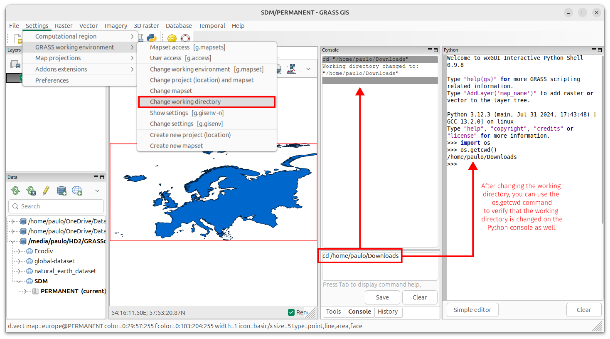{#fig-setworkingdirectory}

## 

Replace `path_to_working_directory` with the path to the folder that you want to use as the working directory.

Be aware that file path notation differs between operating systems. On Windows, backslashes (`\`) are used to separate folder names. On Unix-based operating systems, such as macOS, Linux, and BSD, forward slashes (`/`) are used instead.
:::

Now, whenever you have to refer to an external file, such as text files or GeoTiff files, it is enough to specify the name of the file instead of the full path. 

## Base layers {#sec-baselayers}

We'll import a few base layers, including maps of the national boundaries, roads, rivers, and land use. They will serve as reference layers[^2_obtaining_data-2]. 

) and the urban areas (source: [GLC](https://land.copernicus.eu/en/products/corine-land-cover)).](images/reference_layers.png){#fig-baselayers}

[^2_obtaining_data-2]: *Reference layers* are datasets that provide context and help you to visually navigate the map and understand the geographic setting of the area being analyzed. One of the key advantages of modeling in a GIS environment is the ability to seamlessly integrate and compare model outcomes with these reference layers, and thus to explore and interpret results in their geographic context.

First, download the Geopackage [sdm_base_layers.gpkg](https://ecodiv.earth/share/sdm_in_grassgis/sdm_base_layers.gpkg) and copy the file to your working directory. A GeoPackage (GPKG) is an open, standards-based geospatial data format that can contain one data layer or multiple layers. This GPKG contains three vector layers with respectively the boundries of European countries ([countries]{.style-data}), the main rivers ([rivers]{.style-data}) and the roads ([roads]{.style-data}) in Europe. Import these layers in GRASS.

::: {#exm-XmMn498Mh .hiddendiv}
:::

) and the urban areas (source: [GLC](https://land.copernicus.eu/en/products/corine-land-cover)).](images/reference_layers.png){#fig-baselayers}

For an effective workflow, it is a good idea to organize your data well. For this tutorial, we'll keep the base layers in the [PERMANENT]{.style-db} mapset. We'll use separate mapsets for the input data for our modelling and the modelling results.

### Boundaries {#sec-nationalboundaries}

We'll use the 1:10m scale data from [Natural Earth](https://www.naturalearthdata.com/), a public domain map dataset available at various scales. We download the Shapefile from [Admin 0 - countries](https://www.naturalearthdata.com/downloads/10m-cultural-vectors/) and unzip the data to the working directory. Next, we import the Shapefile in GRASS as [admin0]{.style-data} using [v.in.ogr](https://grass.osgeo.org/grass-stable/manuals/v.in.ogr.html).

::: {#exm-e84zgDAzAIs .hiddendiv}
:::

::: {.panel-tabset group="interface"}
## 

``` bash
v.in.ogr \
input=ne_10m_admin_0_countries.shp \
output=admin0
```

## 

``` python
gs.run_command(
    "v.in.ogr",
    input="ne_10m_admin_0_countries.shp",
    output="admin0",
)
```

## 

Open  [File → v.in.ogr]{.style-menu} menu or [Toolbox → v.in.ogr]{.style-menu} and on the first tab [Required]{.style-menu} find the GeoPackage you just downloaded. Or, if you copied the file to your working directory, you can simply fill in the name of the file under the [Source input]{.style-menu}.

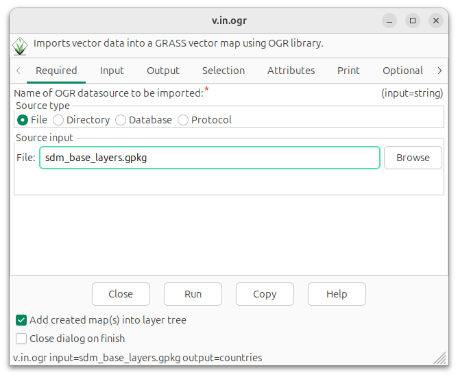{#fig-bcs1 fig-align="left" width=500}

Next, under the [Input]{.style-menu} tab, select the layer [countries]{.style-parameter}. Leave the others unselected.

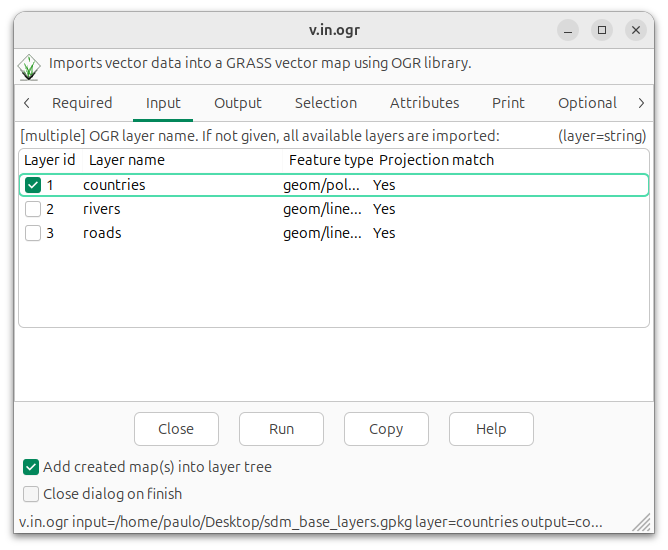{#fig-bcs1 fig-align="left" width=500}

And as last step, under the [Output]{.style-menu} tab, give the output layer the name [countries]{.style-parameter}

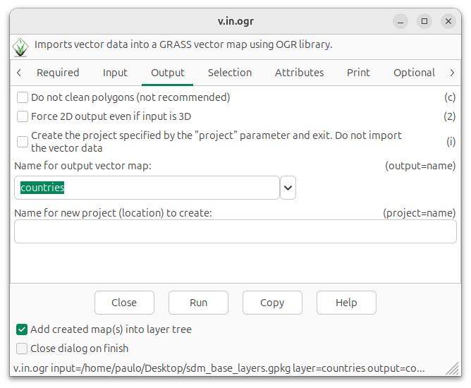{#fig-bcs1 fig-align="left" width=500}

Now, repeat these steps for the other two layers, naming them [roads]{.style-parameter} and the [rivers]{.style-parameter}, respectively.


## 

Note, the assumption is that the GeoPackage file is in your working directory, which you defined in @exm-qpbGaVxfYh. If not, you will have to provide the full path to the file.

When using `v.in.ogr`, a GeoPackage is treated as a container of separate layers, not a single dataset. That means that if the GeoPackage contains multiple layers, each layer must be explicitly specified and imported individually.

: {tbl-colwidths="\[50,50\]"}
:::

Next, download the Copernicus DEM ([CopDEM.tif](https://ecodiv.earth/share/sdm_in_grassgis/CopDEM.tif): downsampled to a resoluton of 0.00833 arc degree), the shaded relief map ([shaded_relief.tif](https://ecodiv.earth/share/sdm_in_grassgis/shaded_relief_NE.tif)) and the Urban areas map ([urban_areas.tif](https://ecodiv.earth/share/sdm_in_grassgis/urban_areas.tif)) and copy the files to your working directory. Next, import these layers in GRASS with the `r.in.gdal` function.

::: {#exm-7Z3CL3lWfe .hiddendiv}
:::

::: {.panel-tabset group="interface"}
## 

``` bash
# Import urban areas raster
r.in.gdal input=urban_areas.tif output=urban_areas

# Import shaded relief raster
r.in.gdal input=shaded_relief.tif output=shaded_relief

# Import the digital elevation model (cop90)
r.in.gdal input=cop90.tif output=cop90

```

## 

``` python
gs.run_command("g.region", n=55, s=35, w=-10, e=33)
```

## 


:::

The next step is to create a vector layer [aoi]{.style-data} with a polygon representing the boundaries of the region's extent using [v.in.region](https://grass.osgeo.org/grass84/manuals/v.in.region.html).

::: {#exm-skRCyG0NKS .hiddendiv}
:::

::: {.panel-tabset group="interface"}
## 

``` bash
v.in.region output=aoi
```

## 

``` python
gs.run_command("v.in.region", output="aoi")
```

## 

Open the [v.in.region]{.style-function} dialog. Fill in:

| Parameter | Value |
|-----------|-------|
| output    | aoi   |

: {tbl-colwidths="\[50,50\]"}
:::

To save some space, we can use the [aoi]{.style-data} vector layer to clip the [admin0]{.style-data} layer to the spatial bounds of the computational region using [v.clip](https://grass.osgeo.org/grass-stable/manuals/v.clip.html), save the result as [countries]{.style-data}, and subsequently remove the [admin0]{.style-data} layer using the [g.remove](https://grass.osgeo.org/grass84/manuals/g.remove.html) module.

::: {#exm-u9sDIGepop .hiddendiv}
:::

::: {.panel-tabset group="interface"}
## 

``` bash
v.clip input=admin0 clip=aoi output=countries
g.remove -f type=vector name=admin0
```

## 

``` python
gs.run_command("v.clip", input="admin0", clip="aoi", output="countries")
gs.run_command("g.remove", flags="f", type="vector", name="admin0")
```

## 

Open the [v.clip]{.style-function} dialog, and fill in:

| Parameter | Value     |
|-----------|-----------|
| Input     | admin0    |
| Clip      | aoi       |
| Output    | countries |

: {tbl-colwidths="\[50,50\]"}
:::

### Roads {#sec-roads}

We'll get the road data from Natural Earth as well. Download it from [here](https://www.naturalearthdata.com/downloads/10m-cultural-vectors/roads/) and unzip it into your working directory. Similar to the previous step, we'll import the data as [tmp]{.style-data} using [v.in.ogr]{.style-function} with the [-r]{.style-parameter} flag.

The vector data includes line features representing roads and ferry routes. Whether a line feature is a road or ferry route is defined in the [featurecla]{.style-parameter} column of the attribute table. We only want to import the roads. We can do this using the [where]{.style-parameter} parameter. This parameter takes as SQL [Where](https://www.sqlitetutorial.net/sqlite-where/) query as an argument to select the features that match a particular condition.

::: {#exm-cMoYfaHQwQ .hiddendiv}
:::

::: {.panel-tabset group="interface"}
## 

``` bash
v.in.ogr -r \
input=ne_10m_roads.shp \
where="featurecla='Road'" \
output=tmp
```

## 

``` python
gs.run_command(
    "v.in.ogr",
    flags="r",
    input="ne_10m_roads.shp",
    where="featurecla='Road'",
    output="tmp",
)

# Import the digital elevation model (eudem)
gs.run_command(
    "r.in.gdal",
    input="eudem.tif",
    output="eudem"
)
```

## 

Open the `r.in.gdal` from the [File]{.style-menu} menu or from the [Toolbox]{.style-menu} and on the first tab [Required]{.style-menu} 

- Select as input the GeoTiff file [urban_areas.tif]{.style-data}
- Set the name of the output raster layer as [urban_areas]{.style-parameter}.
- Click on [Run]{.style-menu}

Repeat for the shaded relief map:

- Select as input the GeoTiff file [shaded_relief_NE.tif]{.style-data}
- Set the name of the output raster layer as [shaded_relief_NE]{.style-parameter}.
- Click on [Run]{.style-menu}

Repeat for the digital elevation model (eudem) map:

- Select as input the GeoTiff file [eudem.tif]{.style-data}
- Set the name of the output raster layer as [eudem]{.style-parameter}.
- Click on [Run]{.style-menu}

: {tbl-colwidths="\[50,50\]"}
:::

Next, we clip the layer to the boundaries of our region with [v.clip](https://grass.osgeo.org/grass-stable/manuals/v.clip.html) and remove the temporary data.

In this particular case, we are out of luck, as the resulting vector layer does not have an attribute table. This type of error is often caused by incorrect attribute data, such as hard returns or invalid column names. The latter is the case here. There is a column 'add', which GRASS does not accept. There are two ways to fix this. Rename the offending column with [v.db.renamecolumn](https://grass.osgeo.org/grass-stable/manuals/v.db.renamecolumn.html) or remove it using [v.db.dropcolumn](https://grass.osgeo.org/grass-stable/manuals/v.db.dropcolumn.html). We'll go for the latter solution.

::: {#exm-e84zg44AIs .hiddendiv}
:::

::: {.panel-tabset group="interface"}
## 

``` bash
# Remove problematic column
v.db.dropcolumn map=tmp columns=add

# Clip to aoi spatial bounds
v.clip input=tmp clip=aoi output=roads

# Remove temporary data
g.remove -f type=vector name=tmp
```

## 

``` python
# Remove problematic column
gs.run_command("v.db.dropcolumn", map="tmp", columns="add")

# Clip to aoi spatial bounds
gs.run_command("v.clip", input="tmp", clip="aoi", output="roads")

# Remove temporary data
gs.run_command("g.remove", flags="f", type="vector", name="tmp")
```

## 

Open the [v.db.dropcolumn]{.style-function} dialog.

| Parameter | Value |
|-----------|-------|
| map       | tmp   |
| column    | add   |

: {tbl-colwidths="\[50,50\]"}

Open the [v.clip]{.style-function} dialog, and fill in:

| Parameter | Value |
|-----------|-------|
| input     | tmp   |
| clip      | aoi   |
| output    | roads |

: {tbl-colwidths="\[50,50\]"}

Open the [g.remove]{.style-function} dialog, and fill in:

| Parameter         | Value  |
|-------------------|--------|
| type              | vector |
| name              | tmp    |
| Force removal (r) | ✅     |

: {tbl-colwidths="\[50,50\]"}
:::

### Rivers {#sec-rivers}

We get the river data from Natural Earth as well ([download link](https://www.naturalearthdata.com/downloads/10m-physical-vectors/10m-rivers-lake-centerlines/)). Download both the [rivers and lake centerlines]{.style-db} and [Europe supplement]{.style-db} Shapefiles and unzip them into your working directory. We'll use the same steps as above to import these layers.

::: {#exm-TpZKQ69XSJ .hiddendiv}
:::

::: {.panel-tabset group="interface"}
## 

``` bash
v.in.ogr -r input=ne_10m_rivers_lake_centerlines.shp output=tmp1
v.in.ogr -r input=ne_10m_rivers_europe.shp output=tmp2
```

## 

``` python
gs.run_command(
    "v.in.ogr",
    flags="r",
    input="ne_10m_rivers_lake_centerlines.shp",
    output="tmp1",
)
gs.run_command(
    "v.in.ogr",
    flags="r",
    input="ne_10m_rivers_europe.shp",
    output="tmp2",
)
```

## 

To import [ne_10m_rivers_lake_centerlines.shp]{.style-data}, fill in the following parameters in [v.in.ogr]{.style-function}:

| Parameter | Value |
|----|----|
| input | ne_10m_rivers_lake_centerlines.shp |
| output | tmp1 |
| Limit the import to the current region (r) | ✅ |

: {tbl-colwidths="\[50,50\]"}

And, to import the [ne_10m_rivers_europe.shp]{.style-data}:

| Parameter                                  | Value                    |
|--------------------------------------------|--------------------------|
| input                                      | ne_10m_rivers_europe.shp |
| output                                     | tmp2                     |
| Limit the import to the current region (r) | ✅                       |

: {tbl-colwidths="\[50,50\]"}
:::

We now clip the imported layers to the boundaries of the European mainland.

::: {#exm-OtEsqXpc4Z .hiddendiv}
:::

::: {.panel-tabset group="interface"}
## 

``` bas
v.clip input=tmp1 clip=aoi output=tmp3
v.clip input=tmp2 clip=aoi output=tmp4
```

## 

``` python
gs.run_command("v.clip", input="tmp1", clip="aoi", output="tmp3")
gs.run_command("v.clip", input="tmp2", clip="aoi", output="tmp4")
```

## 

To clip [tmp1]{.style-data}, open the [v.clip]{.style-function} dialog and fill in the following parameters:

| Parameter | Value |
|-----------|-------|
| input     | tmp1  |
| output    | aoi   |
| clip      | tmp3  |

: {tbl-colwidths="\[50,50\]"}

And, to clip [tmp2]{.style-data} to the area of interest (aoi):

| Parameter | Value |
|-----------|-------|
| input     | tmp2  |
| output    | aoi   |
| clip      | tmp4  |

: {tbl-colwidths="\[50,50\]"}
:::

Next step would be to combine the two layers [tmp3]{.style-data} and [tmp4]{.style-data}. However, the columns in the attribute tables of the two layers are different, both in their names and their order. To make these tables compatible, we need to rearrange and rename the columns so that both tables have the same structure. This requires some SQL code, which we can run using the [db.execute](https://grass.osgeo.org/grass-stable/manuals/db.execute.html) module. We first rename the original tables.

::: {#exm-HnzBvCZB2Y .hiddendiv}
:::

::: {.panel-tabset group="interface"}
## 

``` bash
# Rename the attribute tables # <1>
db.execute sql="ALTER TABLE tmp3 RENAME TO tmp3old;"
db.execute sql="ALTER TABLE tmp4 RENAME TO tmp4old;"
```

1.  We use the SQLite [ALTER TABLE](https://www.tutorialspoint.com/sqlite/sqlite_alter_command.htm) command to renames the existing attribute table. This will decouple them from the vector layer (geometry).

## 

``` python
# Rename the attribute tables # <1>
gs.run_command(
    "db.execute",
    sql="ALTER TABLE tmp3 RENAME TO tmp3old;",
)
gs.run_command(
    "db.execute",
    sql="ALTER TABLE tmp4 RENAME TO tmp4old;",
)
```

1.  We use the SQLite [ALTER TABLE](https://www.tutorialspoint.com/sqlite/sqlite_alter_command.htm) command to renames the existing attribute table. This will decouple them from the vector layer (geometry).

## 

To rename the table [tmp3]{.style-data} to [tmp3old]{.style-data}, open the [db.execute]{.style-function} dialog and, and in the [sql]{.style-parameter} field, we use the SQL [ALTER TABLE](https://www.tutorialspoint.com/sqlite/sqlite_alter_command.htm) command to rename the attribute tables of [tmp3]{.style-data}[^2_obtaining_data-3].

| Parameter | Value                                |
|-----------|--------------------------------------|
| sql       | `ALTER TABLE tmp3 RENAME TO tmp3old` |

: {tbl-colwidths="\[50,50\]"}

Likewise, to rename the table [tmp4]{.style-data}:

| Parameter | Value                                |
|-----------|--------------------------------------|
| sql       | `ALTER TABLE tmp4 RENAME TO tmp4old` |

: {tbl-colwidths="\[50,50\]"}
:::

[^2_obtaining_data-3]: Note, this will decouple them from the vector layer (geometry).

We then create new tables with a subset of columns from the original tables. We give these new tables the name of the original attribute tables. GRASS will automatically use these now as attribute tables.

::: {#exm-Zr2t5IdNW1 .hiddendiv}
:::

::: {.panel-tabset group="interface"}
## 

``` bash
# Create new tables   # <1>
db.execute \
sql="CREATE TABLE tmp3 AS SELECT cat,scalerank,featurecla,name,label,min_zoom,min_label FROM tmp3old"
db.execute sql= "CREATE TABLE tmp4 AS SELECT cat,scalerank,featurecla,name,label,min_zoom,min_label FROM tmp4old"
```

1.  We use the SQLite [CREATE TABLE](https://www.tutorialspoint.com/sqlite/sqlite_create_table.htm) command to create a new table with the original name, but with the correct structure, based on a selection of columns from the table we just renamed in the order we want. Note, this includes the [cat]{.style-data} column, which is used to link the table attributes to the vector features (see @sec-attributemanagement). The new table gets the name of the original table.

## 

``` python
# New attribute tables # <1>
gs.run_command(  # <2>
    "db.execute",
    sql=(
        "CREATE TABLE tmp3 AS "
        "SELECT cat,scalerank,featurecla,name,label,min_zoom,min_label "
        "FROM tmp3old"
    ),
)
gs.run_command(
    "db.execute",
    sql=(
        "CREATE TABLE tmp4 AS "
        "SELECT cat,scalerank,featurecla,name,label,min_zoom,min_label "
        "FROM tmp4old"
    ),
)
```

1.  We use the SQLite [CREATE TABLE](https://www.tutorialspoint.com/sqlite/sqlite_create_table.htm) command to create a new table with the original name, but with the correct structure, based on a selection of columns from the table we just renamed in the order we want. Note, this includes the [cat]{.style-data} column, which is used to link the table attributes to the vector features (see @sec-attributemanagement). The new table gets the name of the original table.

## 

To create a new attribute tables [tmp3]{.style-data} with a subset of the columns from [tmp3old]{.style-data}, open the [db.execute]{.style-function} dialog, and run it with the following SQL code[^2_obtaining_data-4]:

| Parameter | Value |
|----|----|
| sql | `CREATE TABLE tmp3 AS SELECT cat,scalerank,featurecla,name,label,min_zoom,min_label FROM tmp3old` |

: {tbl-colwidths="\[10,90\]"}

And to create a new attribute tables [tmp4]{.style-data} with a subset of the columns from [tmp4old]{.style-data}:

| Parameter | Value |
|----|----|
| sql | `CREATE TABLE tmp4 AS SELECT cat,scalerank,featurecla,name,label,min_zoom,min_label FROM tmp4old` |

: {tbl-colwidths="\[10,90\]"}
:::

[^2_obtaining_data-4]: We use the SQLite [CREATE TABLE](https://www.tutorialspoint.com/sqlite/sqlite_create_table.htm) command to create two new tables with the correct structure, based on a selection of columns from the table we just renamed. Note, this includes the [cat]{.style-data} column, which is used to link the table attributes to the vector features (see @sec-attributemanagement). The new tables get the name of the original tables.

After we have assured the attribute tables of both layers have the same structure, we use [v.patch](https://grass.osgeo.org/grass-stable/manuals/v.patch.html) to combine them into one layer called [rivers]{.style-data}.

::: {#exm-Qh4ZzKINHT .hiddendiv}
:::

::: {.panel-tabset group="interface"}
## 

``` bash
v.patch input=tmp3,tmp4 output=rivers
```

## 

``` python
gs.run_command("v.patch", input=["tmp3", "tmp4"], output="rivers")
```

## 

To patch the two vector layers [tmp3]{.style-data} and [tmp4]{.style-data}, open the [v.patch]{.style-function} dialog and run the function with the following parameters:

| Parameter | Value     |
|-----------|-----------|
| input     | tmp3,tmp4 |
| output    | rivers    |

: {tbl-colwidths="\[30,70\]"}
:::

Last step is to remove the temporary layers. We use [db.droptable](https://grass.osgeo.org/grass-stable/manuals/db.droptable.html) to remove the 'stand-alone' tables, and [g.remove](https://grass.osgeo.org/grass-stable/manuals/g.remove.html) to remove the intermediate vector layers. We use the [pattern]{.style-parameter} parameter and a wildcard to remove all vector layers with a name that start with [tmp]{.style-parameter}. See the [g.remove]{.style-function} [manual page](https://grass.osgeo.org/grass-stable/manuals/g.remove.html) for more details.

::: {#exm-FlhdR7On5I .hiddendiv}
:::

::: {.panel-tabset group="interface"}
## 

``` bash
db.droptable -f table=tmp3old  # <1>
db.droptable -f table=tmp4old
g.remove -f type=vector pattern=tmp*
```

1.  The [db.droptable]{.style-function} module runs the SQLite [DROP TABLE](https://www.tutorialspoint.com/sqlite/sqlite_drop_table.htm) function in the background to remove the old table.

## 

``` python
gs.run_command("db.droptable", flags="f", table="tmp3old")  # <1>
gs.run_command("db.droptable", flags="f", table="tmp4old")
gs.run_command("g.remove", flags="f", type="vector", pattern="tmp*")
```

1.  The [db.droptable]{.style-function} module runs the SQLite [DROP TABLE](https://www.tutorialspoint.com/sqlite/sqlite_drop_table.htm) function in the background to remove the old table.

## 

Open the [db.droptable]{.style-function} dialog, and use the following parameter settings:

| Parameter | Value   |
|-----------|---------|
| table     | tmp3old |

: {tbl-colwidths="\[30,70\]"}

Repeat this, but replace [tmp3old]{.style-parameter} with [tmp4old]{.style-parameter}.

Run [g.remove]{.style-function} with the following parameter settings:

| Parameter         | Value  |
|-------------------|--------|
| type              | vector |
| pattern           | tmp\*  |
| Force removal (r) | ✅     |

: {tbl-colwidths="\[30,70\]"}
:::

### Land cover {#sec-landcover}

Land use plays a crucial role in determining the distribution of many species. The [CORINE Land Cover](https://land.copernicus.eu/en/products/corine-land-cover) (CLC) dataset provides a comprehensive pan-European inventory of land cover and land use. It categorizes the landscape into 44 thematic classes, ranging from broad forested areas to detailed land uses such as vineyards. Updated every six years, the dataset offers both status and change layers, making it a valuable resource for ecological studies.

For this tutorial, we will use the most recent raster layer (as of this writing, the 2018 update) to represent land use. You can [download the dataset here](https://land.copernicus.eu/en/products/corine-land-cover/clc2018#download) (you'll need to have/make an account). After downloading, unzip the files to your working directory.

Once the dataset is ready, import the raster layer into GRASS using the [r.import](https://grass.osgeo.org/grass-stable/manuals/r.import.html) module. This tool allows you to import raster data into GRASS while automatically reprojecting the data if its coordinate system differs from that of your current project. We let the module estimate the target resolution by setting the [resolution]{.style-parameter} to [estimates]{.style-parameter}. As resampling method, we use [nearest]{.style-parameter} (this is the default).

::: {#exm-5LWdebt7OV .hiddendiv}
:::

::: {.panel-tabset group="interface"}
## 

``` bash
r.import extent=region resolution=estimated resample=nearest \
input=U2018_CLC2018_V2020_20u1.tif output=CLC2018 \
title=U2018_CLC2018_V2020_20u1 memory=1000 
```

## 

``` python
gs.run_command(
    "r.import",
    extent="region",
    resolution="estimated",
    resample="nearest",
    input="U2018_CLC2018_V2020_20u1.tif",
    output="CLC2018",
    title="U2018_CLC2018_V2020_20u1",
    memory=1000,
)
```

## 

Run the module [r.import]{.style-function} with the following parameters.

| Parameter  | Value                        |
|------------|------------------------------|
| extent     | region                       |
| resolution | estimated                    |
| resample   | nearest                      |
| input      | U2018_CLC2018_V2020_20u1.tif |
| output     | CLC2018                      |
| title      | U2018_CLC2018_V2020_20u1     |
| memory     | 1000                         |

: {tbl-colwidths="\[50,50\]"}
:::

To assign category labels to our land use map, we use the [r.category](https://grass.osgeo.org/grass-stable/manuals/r.category.html) module. This module allows users to assign category labels to raster values using rules from a text file. The file should have no header, with each line formatted as `raster_value|raster_label` (using a pipe as the separator).

The raster values and labels can be extracted from the [U2018_CLC2018_V2020_20u1.tif.vat.dbf]{.style-file} file, which is included in the downloaded land use map. Open this file in LibreOffice or Excel. The first column contains the raster values, and the third column contains the labels. Use this data to create a category rules file by copying the values and labels into a text file (without the header)[^2_obtaining_data-5]. Save the file as [corina_clc_categories.txt]{.style-file} in your working directory, and apply it using:

[^2_obtaining_data-5]: If you don't know how to do this, see [this spreadsheet](share/corina_reclass_color_rules.ods). You can copy the values from the *category rules* column (without the header) to a text file and save it in your working directory as [corina_clc_categories.txt]{.style-file}.

::: {#exm-BcEwmgX1sG .hiddendiv}
:::

::: {.panel-tabset group="interface"}
## 

``` bash
r.category map=CLC2018 separator=pipe rules=corina_clc_categories.txt
```

## 

``` bash
gs.run_command(
    "r.category", map="CLC2018", separator="pipe", rules="corina_clc_categories.txt"
)
```

## 

Run [r.category]{.style-function} with the following parameters:

| Parameter | Value                     |
|-----------|---------------------------|
| map       | CLC2018                   |
| separator | pipe                      |
| rules     | corina_clc_categories.txt |

: {tbl-colwidths="\[50,50\]"}
:::

To assign a color table to the map, we use the [r.colors](https://grass.osgeo.org/grass-stable/manuals/r.colors.html) module. Color rules can be created using values from columns 1, 4, 5, and 6 of the same [.dbf]{.style-file} file. The [r.colors]{.style-function} manual page provides information about the required format. Or you can follow the example in the [accompanying spreadsheet](share/corina_reclass_color_rules.ods) to create the color rules file. Save it as [corina_clc_colorrules.txt]{.style-file} and apply it using:

::: {#exm-BcEwmgX1sG .hiddendiv}
:::

::: {.panel-tabset group="interface"}
## 

``` bash
r.colors map=CLC2018 rules=corina_clc_colorrules.txt
```

## 

``` bash
gs.run_command(
    "r.colors", map="CLC2018", rules="corina_clc_colorrules.txt"
)
```

## 

``` bash
r.colors map=CLC2018 rules=corina_clc_colorrules.txt
```

| Parameter | Value                     |
|-----------|---------------------------|
| map       | CLC2018                   |
| rules     | corina_clc_colorrules.txt |

: {tbl-colwidths="\[50,50\]"}
:::

Keep in mind that we imported the land cover raster at approximately its original resolution. For further analyses with this layer, it may be necessary to resample this layer so it matches the resolution of other raster layers. GRASS can handle resampling automatically "on the fly", which is convenient. However, it’s important to think critically about whether the default nearest neighbor method is truly the best option. We’ll revisit this topic later, but for now, make a note of it.

## Species range map {#sec-rangemap}

To get an idea of the distribution of our species, we first consult expert-derived range information. A commonly used source is the [IUCN Red List](https://www.iucnredlist.org/).

Visit the website and log in. If you do not yet have an account, create one first. Use the search bar to find the species, preferably by its scientific name.

::: {.callout-note}
The IUCN Red List uses a different scientific name for this species, namely _Erebia albergana_. This is something to be aware of; scientific names are not always used consistently across data sources.
:::

Download the range data and unzip the files into your working directory. If you plan to use these data in a report or publication, note the citation information provided on the webpage (below the Abstract). Recording this information now will save time later and helps ensure proper data attribution.

Next, create a new mapset called [Erebia_alberganus]{.style-data}. This mapset will be used to store the distribution data of our species. Import the downloaded range map into this mapset. Because the mapset itself already identifies the species, the names of the layer is kept generic, for example rangemap and occurrences.

This naming strategy only works if a mapset is dedicated to a single species. If you store data for multiple species in the same mapset, layer names would need to include the species name or another clear identifier to avoid confusion.

::: {#exm-XmMn4IG2Mh .hiddendiv}
:::

::: {.panel-tabset group="interface"}
## 

``` bash
g.mapset -c mapset=Erebia_alberganus
v.in.ogr input=data_0.shp output=rangemap
```

## 

``` python
gs.run_command("g.mapset", flags="c", mapset="Erebia_alberganus")
gs.run_command(
    "v.in.ogr",
    input="data_0.shp",
    output="rangemap",
)
```

## 

Type in `g.mapset` in the console to open the dialog, and use the following parameter settings.

| Parameter                             | Value             |
|---------------------------------------|-------------------|
| mapset                                | Erebia_alberganus |
| Create mapset if it doesn't exist (c) | ✅                |

: {tbl-colwidths="\[50,50\]"}

Run `v.in.ogr with the following parameter settings:

| Parameter | Value                      |
|-----------|----------------------------|
| input     | data_0.shp                 |
| output    | rangemap                   |

: {tbl-colwidths="\[50,50\]"}
:::

## Species occurrences {#sec-occurrence}

The Global Biodiversity Information Facility ([GBIF](https://www.gbif.org/)) provides openly accessible records of species occurrences, which is the primary type of data used in species distribution modeling. 

::: {.aside}
::: {.callout-note appearance="default" title="About GBIF"}
GBIF is an international biodiversity informatics infrastructure that aggregates occurrence data spanning more than three centuries of natural history, including historical museum specimens and contemporary observations. These data are contributed by a wide range of sources, such as research institutions, citizen science initiatives, and automated monitoring programs, and are made freely available under open-data principles.
:::
:::

Before downloading data, you must first register on the site. Once logged in, search for *Erebia alberganus* von Prunner, 1798. Select the result and open the page. Then click on the green button with the number of observations to open the table with observations.

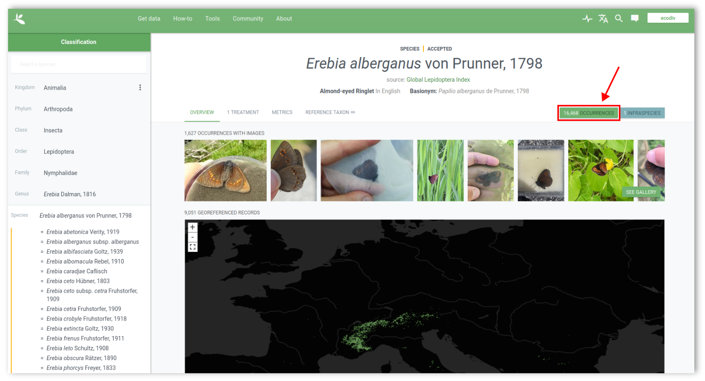{#fig-numerofoccurrences fig-align="left"}

In the new window, apply the filters you consider relevant. For example, under [Basis of record]{.style-menu}, select [Human observation]{.style-menu} and [Occurrences]{.style-menu} to exclude fossil records or machine-based observations. You may also restrict the data to a specific time period, for example, the last 45 years.

Finally, check the [Issues and flags]{.style-menu} section to exclude records with known problems, such as missing coordinates. If you only want to exclude a few issues, you can reverse the selection at the bottom of the list.

Note which filters and what settings you used to select the records. Tip: open the map tab and check the map each time you change a filter to see how it affects the selection of observations.

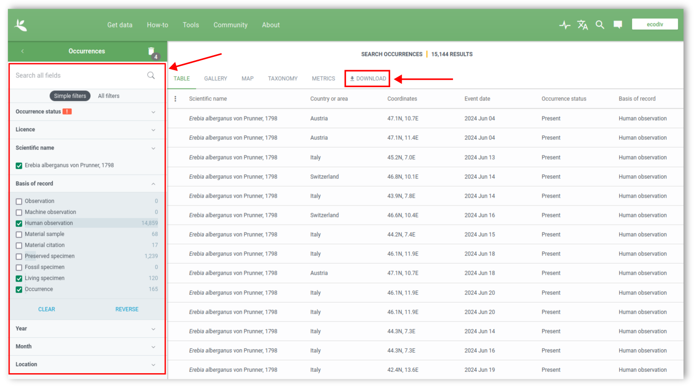{#fig-gbiffilters fig-align="left"}

Click on the [download]{.style-menu} tab and select the [Simple]{.style-menu} option. This will take you to the download page (it may take a while to complete, but you get an email when the download is ready). When the download is complete, download the file and unzip into to your data. 

::: callout-tip
It is good practice to cite the data you use in your publications. GBIF conveniently provides you with the citation on the download page, including a Digital Object Identifier (DOI). This is a link to a web page that describes your search, including any filters you have set. Copy and save the citation, so you can use it in your report. If you are using a reference manager such as [Zotero](https://www.zotero.org/) (highly recommended), you can use the provided BibTex or RIS file to import the reference.
:::

The downloaded file is a tab delimited text file, which can be imported with the [v.in.ascii](https://grass.osgeo.org/grass-stable/manuals/v.in.ascii.html) module. A more convenient way is to import the downloaded data using the [v.in.gbif](https://grass.osgeo.org/grass-stable/manuals/addons/v.in.gbif.html) module. It's an addon, so install it if you haven't done so yet.

::: {#exm-EZ65hmOvkK .hiddendiv}
:::

::: {.panel-tabset group="interface"}
## 

Replace the name of the input file with the name of the CSV file you downloaded from GBIF.

``` bash
v.in.gbif input=0069182-251120083545085.csv output=occurrences
```

## 

``` python
gs.run_command(
    "v.in.gbif", input="DataFiles/speciesdata/0069182-251120083545085.csv", output="occurrences"
)
```

## 

Open the `v.in.gbif` dialog, and run it with the following parameter settings:

| Parameter | Value                       |
|-----------|-----------------------------|
| input     | 0069182-251120083545085.csv |
| output    | occurrences       |

: {tbl-colwidths="\[50,50\]"}
:::

After importing the data in GRASS, it is good practice to check carefully for outliers and other possible problems. If you zoom to the extent of the data, you may find out that there are a outliers that are clearly erroneous, such as points in the ocean. A common problem is features with coordinates at (0, 0). These typically indicate records with missing coordinates that were filled with zeros during data preparation or import. You can easily identify such cases by opening the attribute table and sorting by [g.decidmallatitude]{.style-parameter} or [decimalLongitude]{.style-parameter} (click on the column header). 

::: {#exm-84575 .hiddendiv}
:::

::: {.panel-tabset}
## 

You can remove these points using the [v.db.droprow](https://grass.osgeo.org/grass-stable/manuals/v.db.droprow.html) module, which creates a new vector map containing only the features that do not match the selection criteria. 

``` bash
# Select and remove features
v.db.droprow input=occurrences where="g_decimallatitude=0" output=temp
```

Because `v.db.droprow` does not allow to modify data in place, the subsequent [g.rename](https://grass.osgeo.org/grass-stable/manuals/g.rename.html) step is used to replace the original vector map with the cleaned version and remove the temporary intermediate map.

``` bash
# Replace previous layer with current version, using the original name
g.rename vector=temp,occurrences --overwrite
```

## 

You can remove these points using the [v.db.droprow](https://grass.osgeo.org/grass-stable/manuals/v.db.droprow.html) module, which creates a new vector map containing only the features that do not match the selection criteria. 

``` python
gs.run_command(
    "v.db.droprow",
    input="occurrences@Erebia_alberganus",
    where="g_decimallatitude=0",
    output="temp"
)
```

Because `v.db.droprow` does not allow to modify data in place, the subsequent [g.rename](https://grass.osgeo.org/grass-stable/manuals/g.rename.html) step is used to replace the original vector map with the cleaned version and remove the temporary intermediate map.

``` python
# Replace previous layer with current version, using the original name
gs.run_command("g.rename", vector="temp,occurrences", overwrite=True)
```


## 

Open the `v.db.droprow` dialog, and run it with the following parameter settings:

| Parameter | Value                           |
|-----------|---------------------------------|
| input       | occurrences@Erebia_alberganus |
| where       | g_decimallatitude=0           |
| output      | temp                          |

Because `v.db.droprow` does not allow to modify data in place, the subsequent [g.rename](https://grass.osgeo.org/grass-stable/manuals/g.rename.html) step is used to replace the original vector map with the cleaned version and remove the temporary intermediate map. Run it with the following parameter settings:

| Parameter | Value                |
|-----------|----------------------|
| vector       | temp,occurrences  |
| overwrite    | ✅                |


: {tbl-colwidths="\[50,50\]"}


## 

Here are several alternative ways to remove these erroneous points:

- One option is to use v.edit to delete the points directly. Be aware, however, that this approach removes only the geometries; the corresponding rows in the attribute table remain.
- Alternatively, you can open the occurrences attribute table, sort by g_decimallatitude, select the rows where g_decimallatitude = 0, then right-click and choose Delete selected features.
- You can also remove the points manually in editing mode. Activate editing by clicking the pencil icon in the Layers panel, select the points with latitude 0, and delete them.
- Another option is to use [v.extract](https://grass.osgeo.org/grass-stable/manuals/v.extract.html) to create a new layer containing only valid points—for example, by extracting all features with latitude greater than 0.

Being aware of these alternatives is useful, as the most appropriate method depends on the specific task and your familiarity with the available tools.

:::

Not all errors are that obvious. To identify other potential problems, you will need to visually inspect the data and compare them with other sources of information, like the RED list range map (@fig-rangemapoccurrences). 

One likely error in the data are the points on the northern coast of France (@fig-rangemapoccurrences). These points are far outside the known range of the species, so we are going to assume that these are errors. You can check that these points are above 50 degrees latitude. We can delete them in the same way as the previous example.

::: {#exm-845752 .hiddendiv}
:::

::: {.panel-tabset}
## 

``` bash
# Select and remove features
v.db.droprow input=occurrences where="g_decimallatitude>=50" output=temp

# Replace previous layer with current version, using the original name
g.rename vector=temp,occurrences --overwrite
```

## 

``` python
# Remove the features (points)
gs.run_command(
    "v.db.droprow",
    input="occurrences",
    where="g_decimallatitude>=50",
    output="temp"
)

# Replace previous layer with current version, using the original name
gs.run_command(
    "g.rename",
    vector="temp,occurrences",
    overwrite=True,
)
```

## 

Open the `v.db.droprow` dialog, and run it with the following parameter settings:

| Parameter | Value                           |
|-----------|---------------------------------|
| input       | occurrences@Erebia_alberganus |
| where       | g_decimallatitude>=50           |
| output      | temp                          |

Run `g.rename` with the following parameter settings:

| Parameter | Value                |
|-----------|----------------------|
| vector       | temp,occurrences  |
| overwrite    | ✅                |


: {tbl-colwidths="\[50,50\]"}

## 

You could also combined @exm-84575 and this step into a single command to select and drop the points.

``` bash
# Select and remove features
v.db.droprow input=occurrences where="g_decimallatitude>=50 OR g_decimallatitude=0" output=temp

# Replace previous layer with current version, using the original name
g.rename vector=temp,occurrences --overwrite
```

You can obviously do the same in Python as well.

:::

There are a few other discrepancies between the range map and the occurrence data (@fig-rangemapoccurrences), which you normally would want to further check. However, for the sake of this tutorial, we'll assume that the GBIF data is OK.

 for the code used to create this map.](images/rangemap.png){#fig-rangemapoccurrences fig-align="left"}

We have now the species occurrence data ready for modeling. Next step is to download the various environmental layers that will be used as explanatory variables in the modeling.

## Current climate {#sec-climatedata}

As explanatory variables for the species distribution modeling, we'll use the 19 bioclimatic variables from Worldclim[@fick2017]. Bioclimatic (or bioclim in short) variables are derived from the monthly temperature and rainfall values in order to generate more biologically meaningful variables. 

::: {.aside}
::: {.callout-note appearance="default" title="Bioclim variables"}
The bioclimatic variables represent annual trends (e.g., mean annual temperature, annual precipitation) seasonality (e.g., annual range in temperature and precipitation) and extreme or limiting environmental factors (e.g., temperature of the coldest and warmest month, and precipitation of the wet and dry quarters). See [this page](https://worldclim.org/data/bioclim.html) for a description of all 19 variables.
<br>

:::
:::

You can download historical and future climate data. The former represents climate conditions for the period 1970-2000. For the modeling exercise, they are considered to represent the recent / current climate conditions. 

Both historical and future data sets are available in raster format at different resolutions. Go to the [Download page](https://www.worldclim.org/data/worldclim21.html#), download the 2.5 arc minutes historical bioclim data (@fig-worldclimhistoricbioclim) and unzip the GeoTiff files to your working directory. 

{#fig-worldclimhistoricbioclim fig-align="left"}

We'll create a new mapset [climate]{.style-data} to store the climate data, using the [g.mapset](https://grass.osgeo.org/grass-stable/manuals/g.mapset.html) module with the [-c]{.style-parameter} flag. Next, we use the [g.region](https://grass.osgeo.org/grass-stable/manuals/g.region.html) module to set the boundaries of the region for which we want to import the data. 

::: {.callout-note appearance="simple"}

Be aware that a new mapset starts with default settings for the computational region. This means that the region set earlier for the [Parameter]{.style-data} mapset does not apply to the new [climate]{.style-data} mapset. Each mapset has its own computational region settings
:::

One option is to use the region extent we defined earlier. Or, now that we know more precisely where our species has been observed, we can defined new bounds using the `g.region` module with the [n]{.style-parameter}, [s]{.style-parameter}, [e]{.style-parameter}, and [w]{.style-parameter} parameters (see below). We set the resolution to match that of the climate layers. This is 2.5 arc minutes, which is equal to 2.5 / 60 = 0.041666666666667. 

::: {#exm-OgizA6dRXy .hiddendiv}
:::

::: {.panel-tabset group="interface"}
## 

``` bash
g.mapset -c mapset=climate
g.region n=54 s=36 w=-10 e=32 res=0.041666666666667
```

## 

First, we create a new mapset.

``` python
gs.run_command("g.mapset", flags="c", mapset="climate")
gs.run_command("g.region", n=54, s=36, w=-10, e=32, res=0.041666666666667)
```

## 

Type in `g.mapset` in the console to open the dialog, and use the following parameter settings.

| Parameter                             | Value           |
|---------------------------------------|-----------------|
| Name of mapset (mapset)               | climate |
| Create mapset if it doesn't exist (c) | ✅              |

: {tbl-colwidths="\[50,50\]"}

Next, we define the computational region for the new mapset. Open the `g.region` dialog, and use the following parameter settings.

| Parameter                       | Value   |
|---------------------------------|---------|
| Value for the northern edge (n) | 54      |
| Value for the southern edge (s) | 36      |
| Value for the eastern edge (e)  | 32      |
| Value for the western edge (w)  | -10     |
| 2D grid resolution (res)        | 0.041666666666667 |

: {tbl-colwidths="\[50,50\]"}

Alternatively, you can define the region's bounds manually in the [Map display]{.style-menu}, as explained in @sec-computationalregion.

## 

Note that, if the region and the raster layer are not perfectly aligned, the area that is imported will be slightly larger than the computational region. How much larger depends on the resolution of the computational region, as explained in (@sec-computationalregion). We therefore use the [res]{.style-parameter} parameter to set the resolution to match the resolution of the layers we want to import.

Remember to calculate the resolution in decimal degrees. For 2.5 arc minutes, this is 2.5 / 60 = 0.041666666666667. If you work at another resolution, make sure to adapt this value accordingly. For example, when working with 30 arc seconds data, the resolution would be 30 / 3600 = 0.00833333333333333 degrees.

:::

To import the bioclim data, we use [r.in.gdal](https://grass.osgeo.org/grass-stable/manuals/r.in.gdal.html) with the [-r]{.style-parameter} flag to tell GRASS to limit the import of the data to the area defined by the computational region that we defined in the previous step. To speed up the import, we use the [memory]{.style-parameter} parameter to set the maximum memory to be used (in MB) to be equal to the size of the input file (or otherwise to the maximum amount available on your system).

To avoid having to type in the same command 19 times, we can use a small script to automate the process. If you prefer to use the GUI, the [r.import](https://grass.osgeo.org/grass-stable/manuals/r.import.html) functions offers the possibility to batch import layers, as illustrated in the video under the []{.paneltabcolor} tab.

::: {#exm-vavvH110fv .hiddendiv}
:::

::: {.panel-tabset group="interface"}
## 

``` bash
base="wc2.1_2.5m_bio_"
for n in {1..19}; do
    input="${base}${n}.tif"
    output="bio_${n}"
    r.in.gdal -r input=${input} output=${output} memory=1000
done
```

1.  Change the base name of the GeoTiff files if you downloaded the lower resolution data. In the for loop, the base name, number and file extension will be combined to the name of the file to be imported.
2.  The 'for' loop will import the layer 1 to 19. Each round, the names of the input and output layers are created and used as input for r.in.gdal.
3.  The number and file extension are added to complete the path+name of the file to be imported.
4.  The name of the imported raster layer is created by combining the base name (bio\_) and the number.
5.  The [-r]{.style-parameter} flag is set to limit the import to the regional bounds. To speed up the import, the [memory]{.style-parameter} parameter should be set to be equal to the size of the import file. If that is not possible, use the maximum value that is possible on your system.

## 

``` python
base = "wc2.1_2.5m_bio_"
for n in range(1, 20):
    input = f"{base}{n}.tif"
    output = f"bio_{n}"
    gs.run_command(
        "r.in.gdal",
        flags="r",            # <5>
        input=input,
        output=output,
        memory=1000,          # <6>
    )
```

## 


:::

As mentioned earlier, GRASS will import raster layers with the resolution and alignment of the original raster files. This means the computational region and the raster layers may not be perfectly aligned. In addition, the region’s resolution may not match that of the imported layers. To check this, you can run with the [-g]{.style-parameter} and compare the outcomes with those of the [r.info](https://grass.osgeo.org/grass-stable/manuals/r.info.html) module.

::: {#exm-uqHZOxgy43 .hiddendiv}
:::

::: {.panel-tabset group="interface"}
## 

``` bash
g.region -p
r.info map=bio_1
```

## 

``` python
gs.run_command("g.region", flags="p")
gs.run_command("r.info", map="bio_1")
```

## 

Type in in the console to open the `g.region` dialog, and use the following parameter settings.

| Parameter                    | Value |
|------------------------------|-------|
| Print the current region (p) | ✅    |

: {tbl-colwidths="\[50,50\]"}

Open the `r.info` dialog, and run it with the following parameter settings:

| Parameter | Value |
|-----------|-------|
| map       | bio_1 |

: {tbl-colwidths="\[50,50\]"}
:::

If the extent differs, we use the [g.region](https://grass.osgeo.org/grass-stable/manuals/.html) module again, but this time with the [raster]{.style-parameter} parameter to set the region extent and resolution to match that of one of the imported bioclim layers[^2_obtaining_data-10]. We use the [save]{.style-parameter} parameter to save the current region settings as [region_aoi]{.style-data} for future use.

[^2_obtaining_data-10]: The different options of the `g.region` function provide a lot of flexibility in to how to define the region. You are encouraged to carefully consider the different options each time you use this module.

::: {#exm-V0FK31454 .hiddendiv}
:::

::: {.panel-tabset group="interface"}
## 

``` bash
g.region raster=bio_1 save=region_aoi
```

## 

``` python
gs.run_command("g.region", raster="bio_1", save="region_aoi")
```

## 

Open the dialog of the `g.region` module, and run it with the following parameter settings:

| Parameter | Value      |
|-----------|------------|
| raster    | bio_1      |
| save      | region_aoi |

: {tbl-colwidths="\[50,50\]"}

## 

With the [raster]{.style-parameter} parameter, the region extent and resolution are set to match that of the specified raster layer (here bio_1). The [save]{.style-parameter} parameter saves the current region settings as a region file called [region_aoi]{.style-data}, which can be used later to quickly set the region to these settings again, for example when creating new mapsets. 

:::

It is important to note that the geographic region is defined per mapset. It is therefore the computational region of the mapset you are working in that defines the geographic area and resolution in which raster analyses are performed. See the [manual page](https://grass.osgeo.org/grass-stable/manuals/g.region.html) for more information.

::: {.callout-note appearance="simple"}
If a raster map does not match the resolution or extent of the current computational region, GRASS will resample it on the fly. By default, this resampling uses the nearest-neighbor method, which is not always the most appropriate choice. In such cases, it is better to resample the raster explicitly in advance, using a method suited to the data and analysis. See [menu: Raster → Develop raster map]{.style-menu} for options.
:::

@fig-bioclimvars shows the bioclimatic maps 1 to 19 that we have just imported for our study area. The maps also show the range map of the Almond-eyed Ringlet butterfly. In case you are interested, see [here](#sec-bioclimvars) for the code used to create the maps.

::: {#fig-bioclimvars layout-ncol="4"}
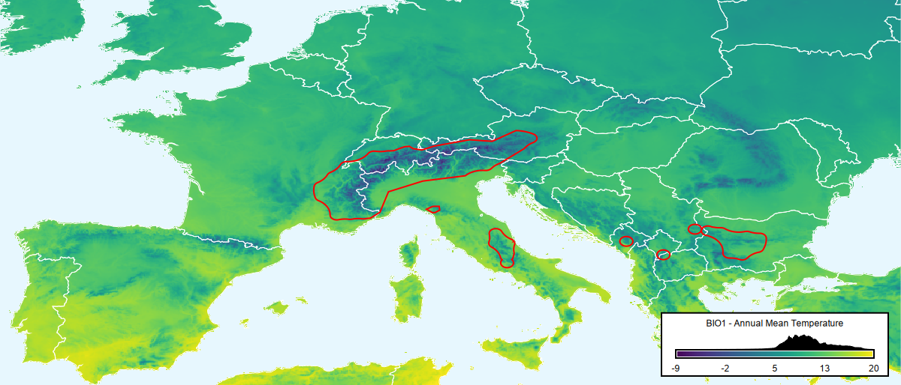{group="LRNlhoGosy"}

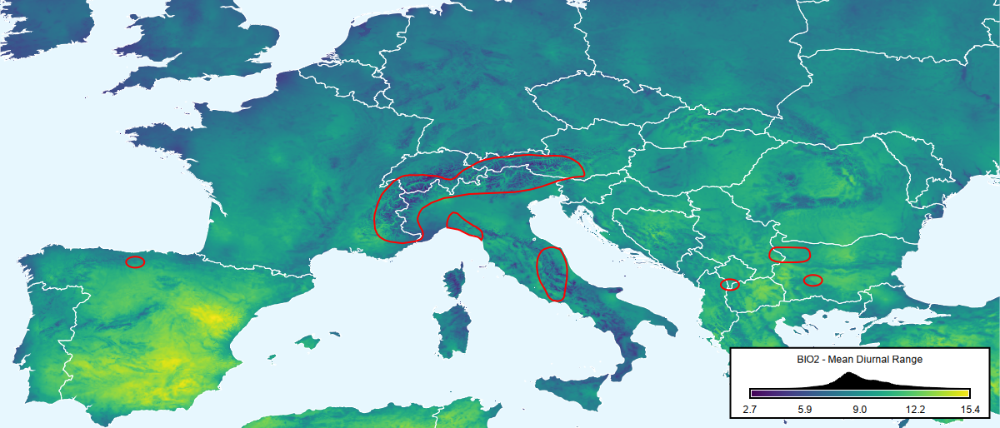{group="LRNlhoGosy"}

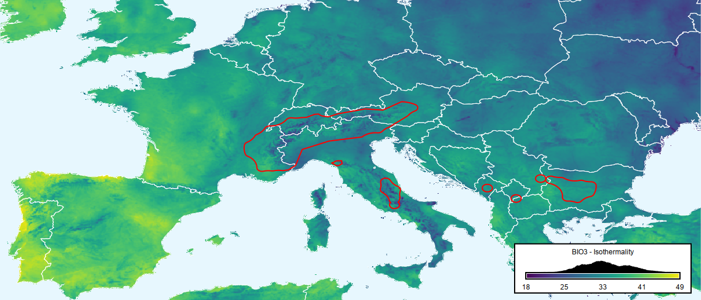{group="LRNlhoGosy"}

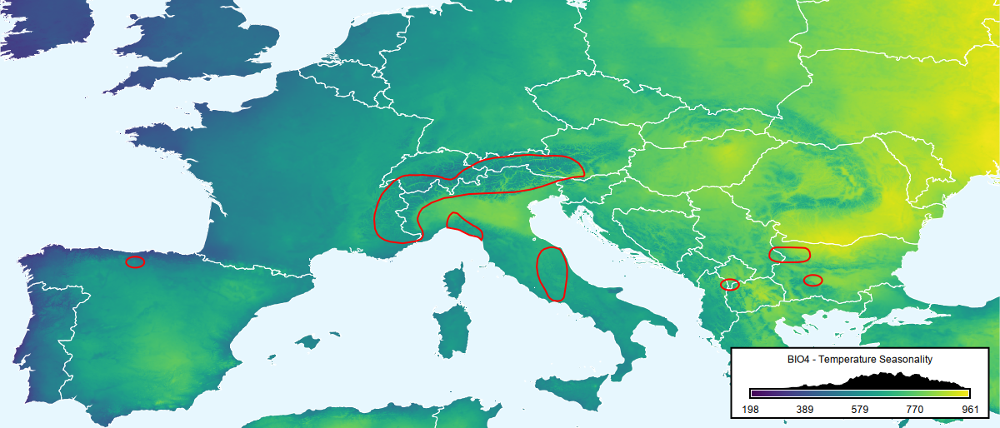{group="LRNlhoGosy"}

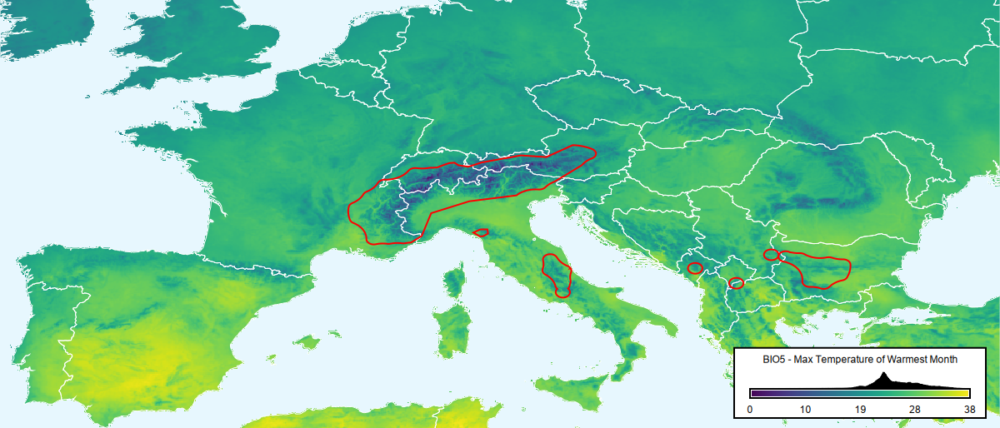{group="LRNlhoGosy"}

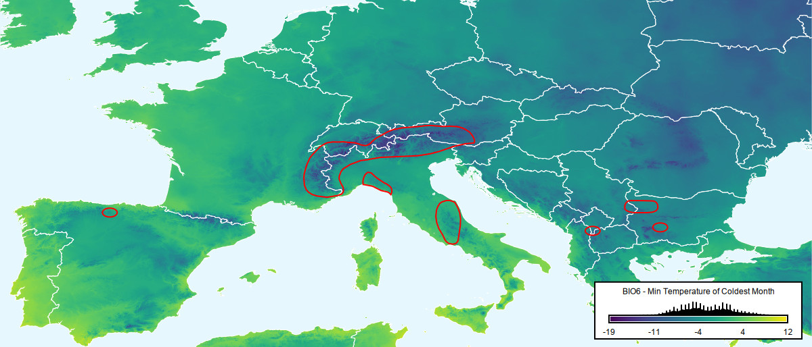{group="LRNlhoGosy"}

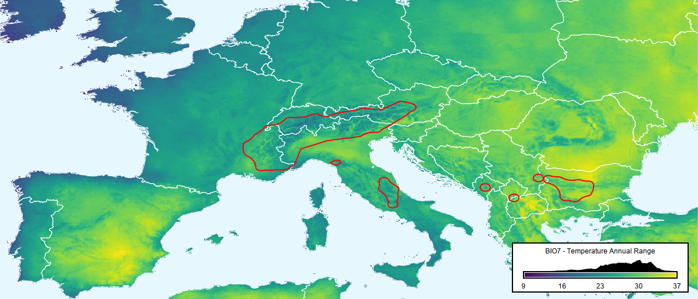{group="LRNlhoGosy"}

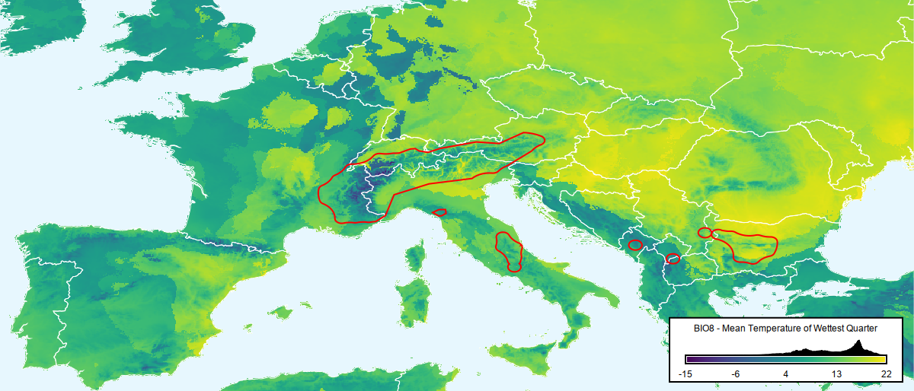{group="LRNlhoGosy"}

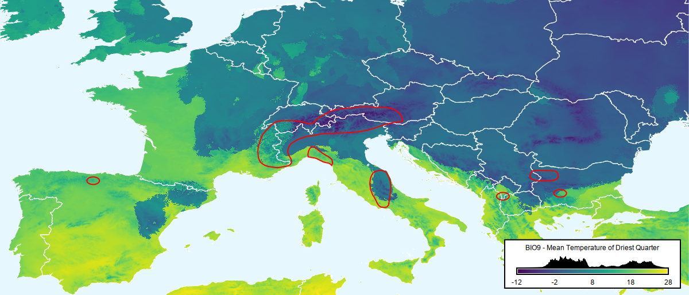{group="LRNlhoGosy"}

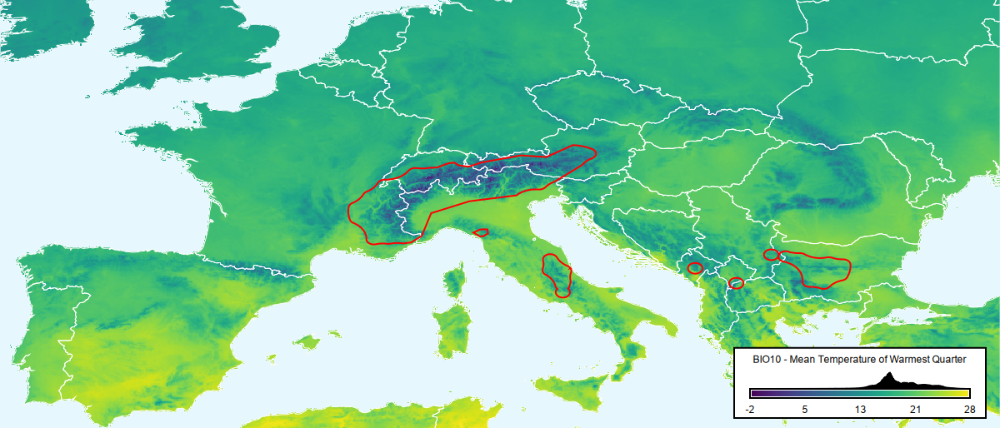{group="LRNlhoGosy"}

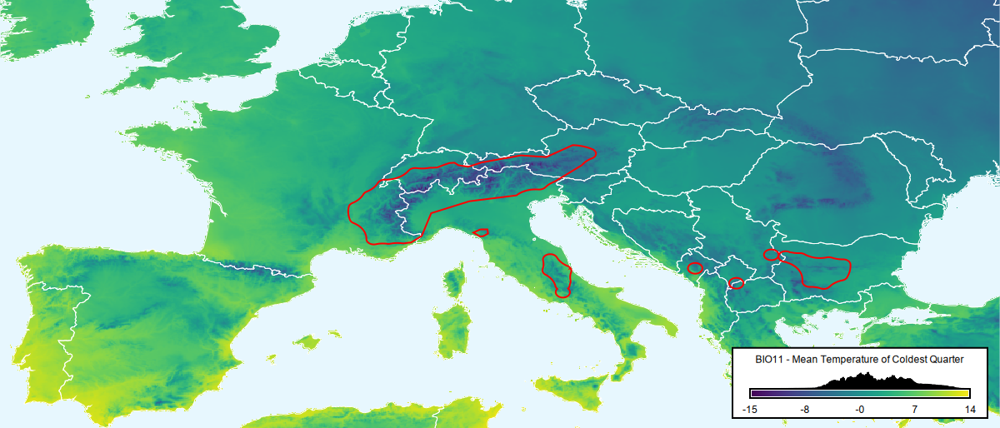{group="LRNlhoGosy"}

{group="LRNlhoGosy"}

{group="LRNlhoGosy"}

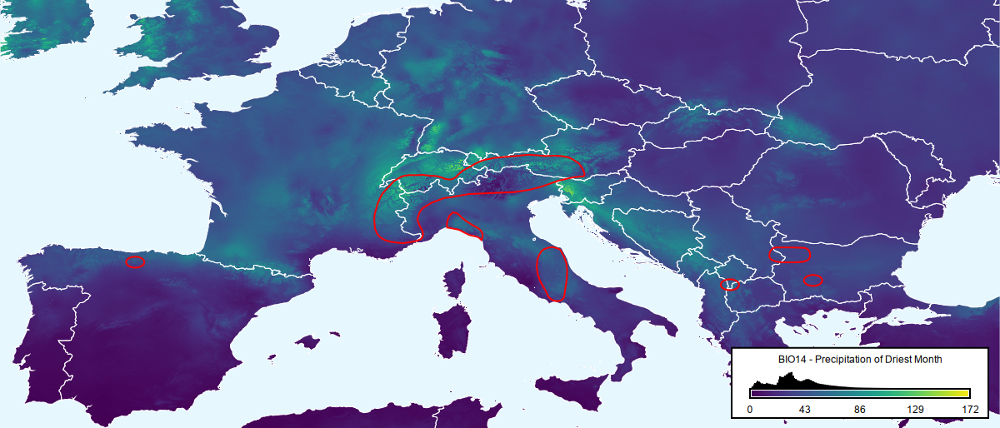{group="LRNlhoGosy"}

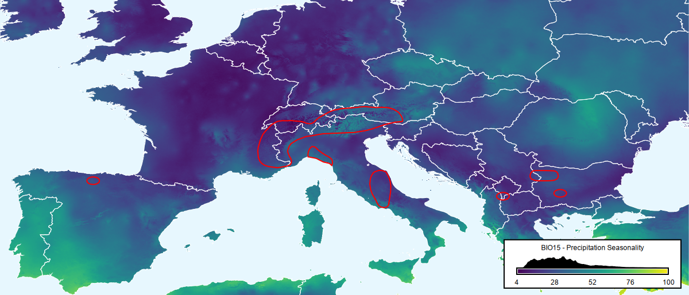{group="LRNlhoGosy"}

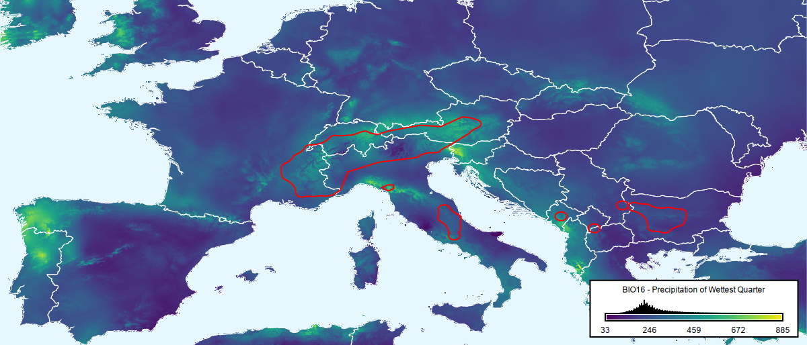{group="LRNlhoGosy"}

{group="LRNlhoGosy"}

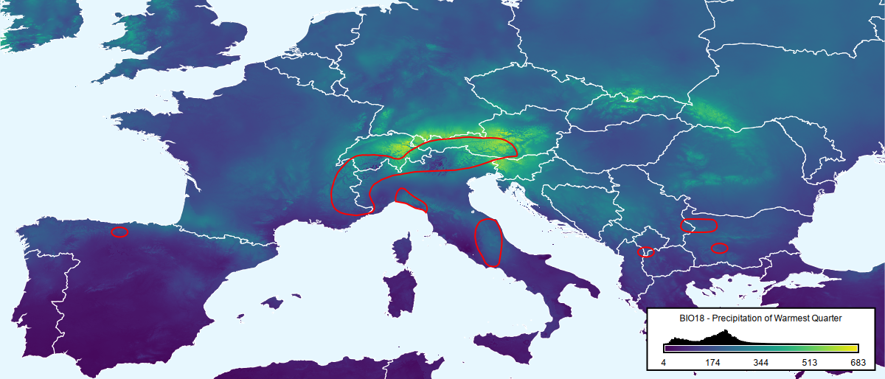{group="group"}

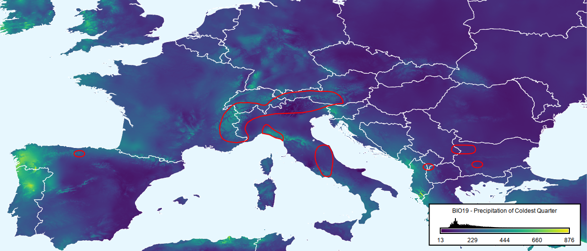{group="group"}

Bioclimatic variable 1 to 19 from [Worldclim version 2.0](https://www.worldclim.org/data/bioclim.html). The red outlines show the distribution of the Almond-eyed Ringlet butterfly according to the [IUCN Red List](https://www.iucnredlist.org/species/173278/6984115). Click on the image to enlarge and view the maps in detail.
:::

## Future climates {#sec-obtainfutureclimatelayers}

To model the potential distribution of our species under future climate conditions, we use downscaled [future climate projections](https://www.worldclim.org/data/cmip6/cmip6climate.html) from Worldclim. There are bioclim data from 14 different general circulation models (GCMs) available for download. For each GCM, you can choose between data representing projected conditions in the periods (2021–2040, 241–2060, 2061–2080, and 2081-2100). You can furthermore choose between data based on the Shared Socio-economic Pathways ([SSPs](https://www.carbonbrief.org/cmip6-the-next-generation-of-climate-models-explained)) 126, 245, 370 and 585. We'll use the *2.5 arc-minute* bioclim variables for the period *2081-2100* based on the *SSP585* from the GCM [EC-Earth3-Veg]{.style-data}. Download the data and save it to your working directory.

Note that the future climate layers come as one multi-band GeoTiff file, unlike the current climate data where each bioclim variable is stored as a separate GeoTiff file. The file has 19 bands, representing the 19 bioclimatic variables (band 1 represents bioclim 1, band 2 bioclim 2, etc.). To verify this, you can use the [gdalinfo](https://gdal.org/en/latest/programs/gdalinfo.html) function from the command line. 

::: panel-tabset
## 

``` bash
gdalinfo wc2.1_2.5m_bioc_EC-Earth3-Veg_ssp585_2081-2100.tif 
```

{#fig-gdalinfofutclim}
:::

We will store the data in the [climate]{.style-data} mapset. The `r.in.gdal` module conveniently imports each band of the input file as a separate raster layer.

Using the [output]{.style-parameter} parameter, we assign the imported layers a common name that includes, in abbreviated form, the model name, the SSP, and the time period, for example ECE3V_585_8100. The module then appends the band number to this prefix.

When choosing a naming pattern, aim to keep the name short while ensuring that the key information can still be reconstructed from it. This makes it easier to manage and compare layers, especially if you later work with multiple future climate scenarios. In addition, always keep a clear record of which names correspond to which datasets.

When possible, increase the value of the [memory]{.style-parameter} parameter, as this can considerably speed up the import process.


::: {#exm-1a5tTJ1LeP .hiddendiv}
:::

::: {.panel-tabset group="interface"}
## 

``` bash
r.in.gdal input=wc2.1_2.5m_bioc_EC-Earth3-Veg_ssp585_2081-2100.tif output=ECE3V_585_8100 memory=1000 -r
```

## 

``` python
gs.run_command(
    "r.in.gdal",
    flags="r",
    input="wc2.1_2.5m_bioc_EC-Earth3-Veg_ssp585_2081-2100.tif",
    output="ECE3V_585_8100",
    memory=1000,
)
```

## 

Type in `r.in.gdal` in the console to open the dialog, and use the following parameter settings.

| Parameter | Value |
|----|----|
| input | wc2.1_2.5m_bioc_EC-Earth3-Veg_ssp585_2081-2100.tif |
| output | ECE3V_585_8100 |
| memory | 1000 |
| Limit import to current region (r) | ✅ |


## 

Remember that we set the computational region in the previous step so that:

- it matches the extent of our area of interest
- it matches the resolution of the current climate data
- it is aligned with the current climate data

As the future climate layers are derived from the same source as the current climate data, they have the same alignment and resolution as the current climate layers. By setting the computational region as we did, and by using the [-r]{.style-parameter} flag of the `r.in.gdal`, we ensure that the future climate layers are imported for the same geographic area and at the same resolution as the current climate layers.

:::

@fig-futbioclimvars shows the projected bioclimatic conditions for 2081-2100 (bioclim variables 1 to 19) that we have just imported for our study area. The maps also show the range map of the Almond-eyed Ringlet butterfly.

::: {#fig-futbioclimvars layout-ncol="4"}
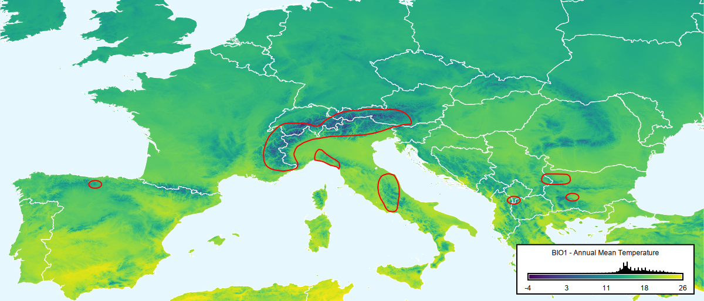{group="NsFOs6E8BO"}

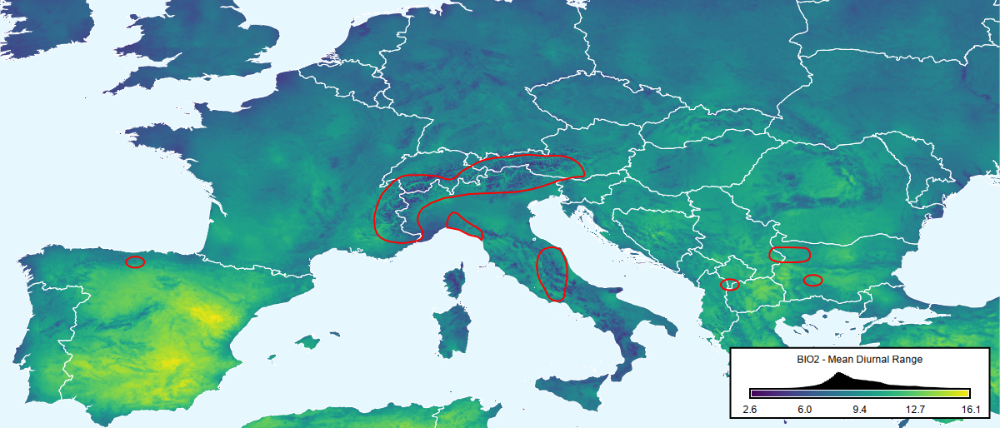{group="NsFOs6E8BO"}

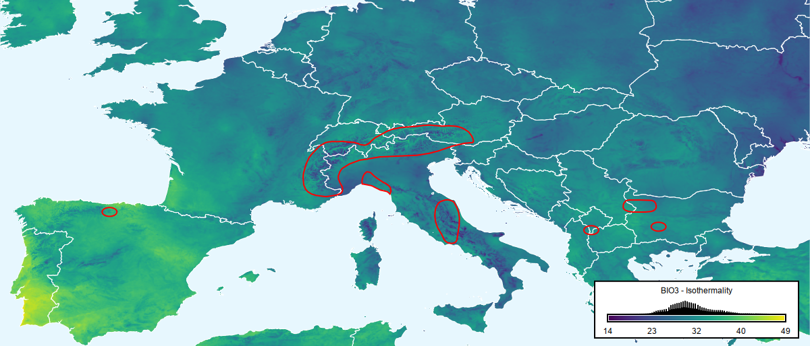{group="NsFOs6E8BO"}

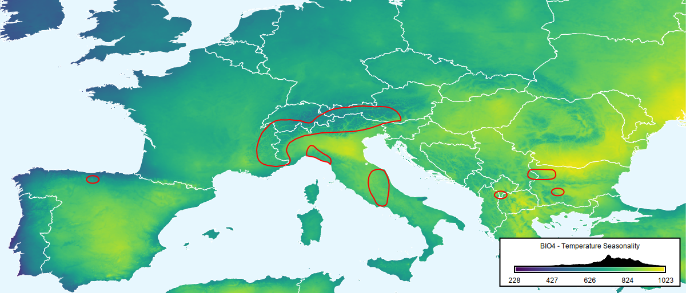{group="NsFOs6E8BO"}

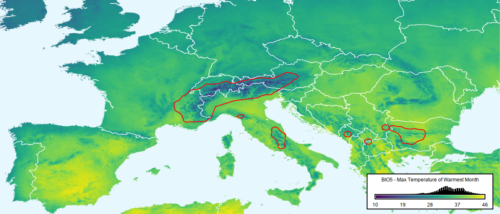{group="NsFOs6E8BO"}

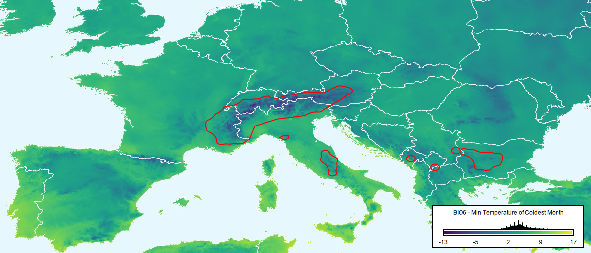{group="NsFOs6E8BO"}

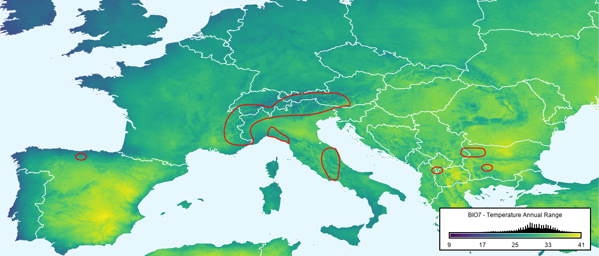{group="NsFOs6E8BO"}

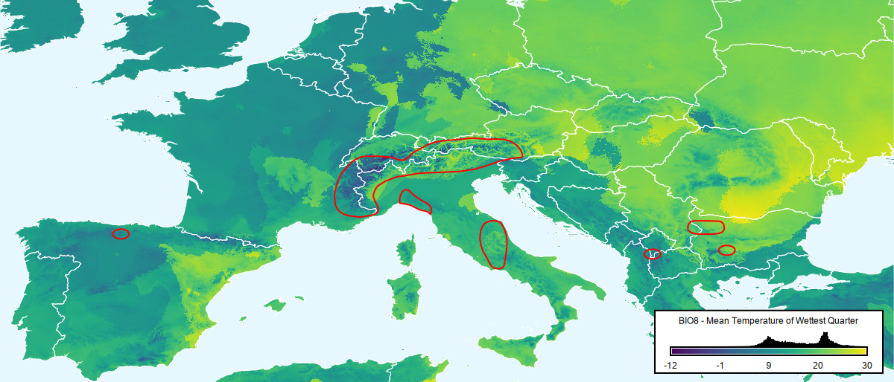{group="NsFOs6E8BO"}

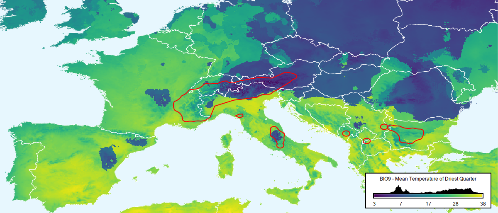{group="\"NsFOs6E8BO"}

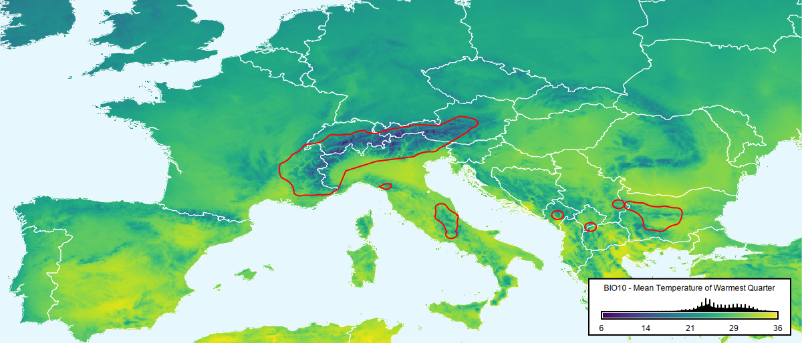{group="NsFOs6E8BO"}

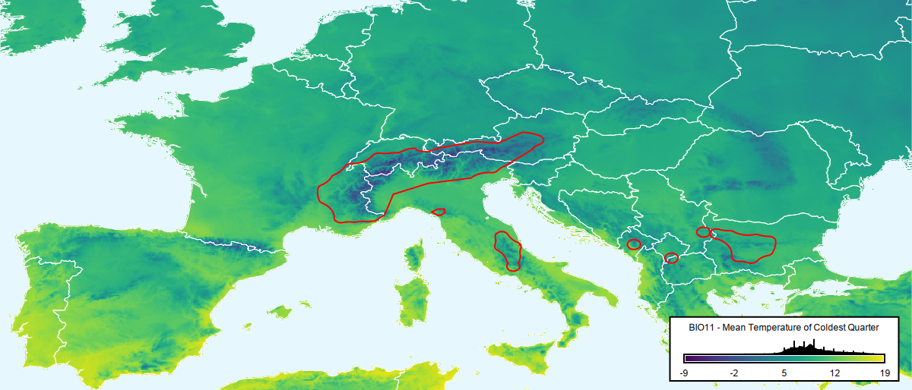{group="NsFOs6E8BO"}

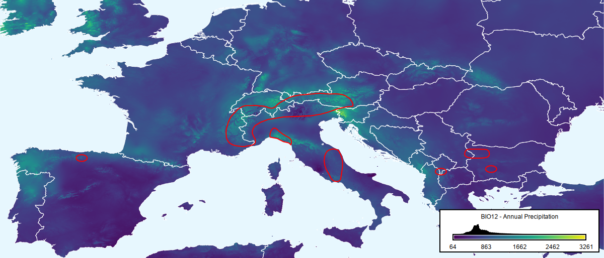{group="NsFOs6E8BO"}

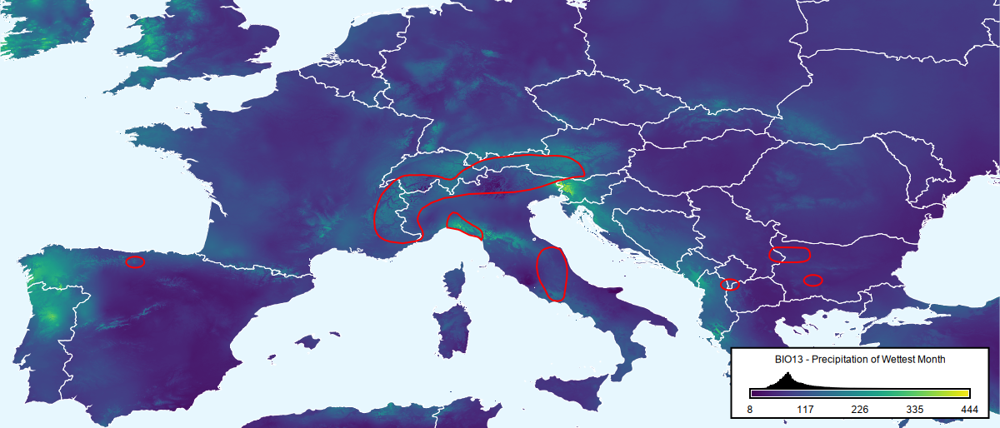{group="NsFOs6E8BO"}

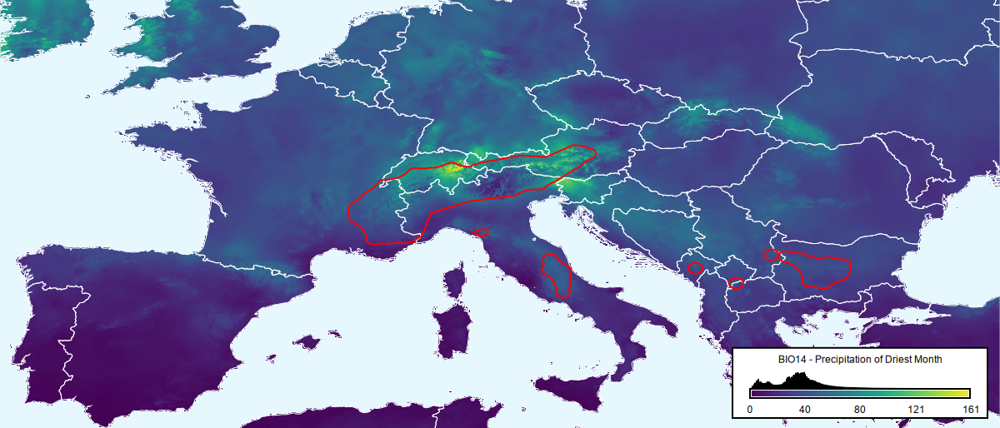{group="NsFOs6E8BO"}

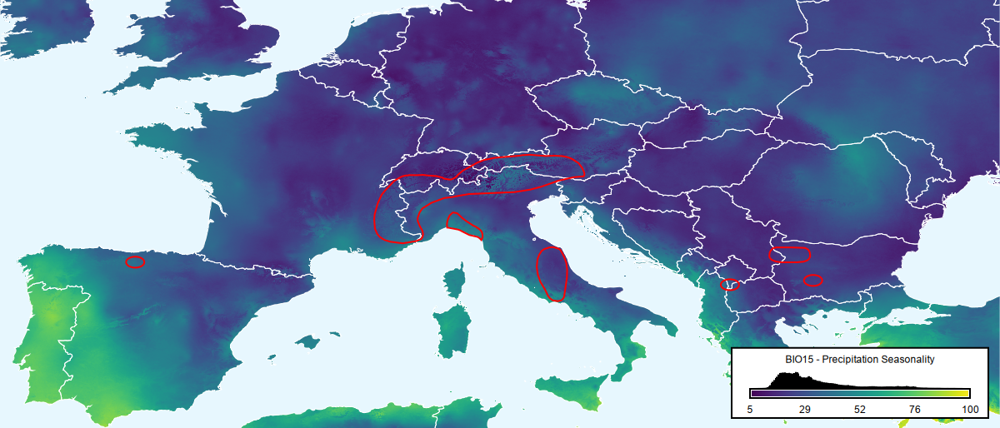{group="NsFOs6E8BO"}

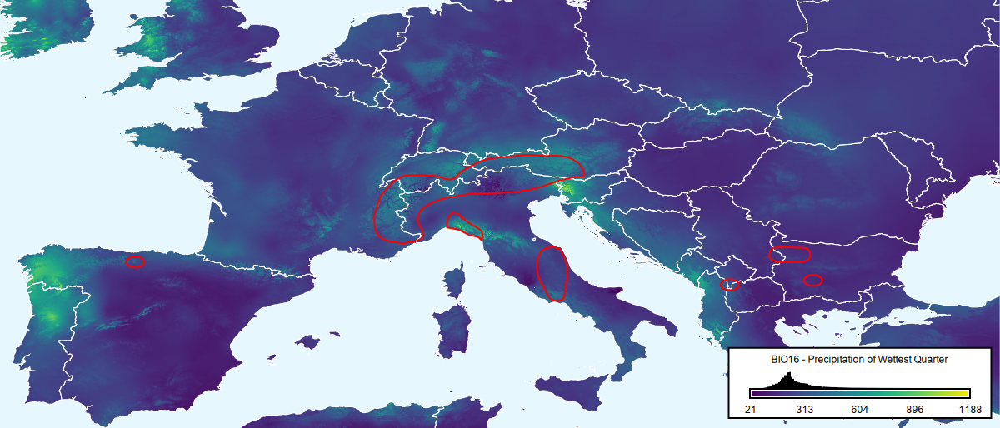{group="NsFOs6E8BO"}

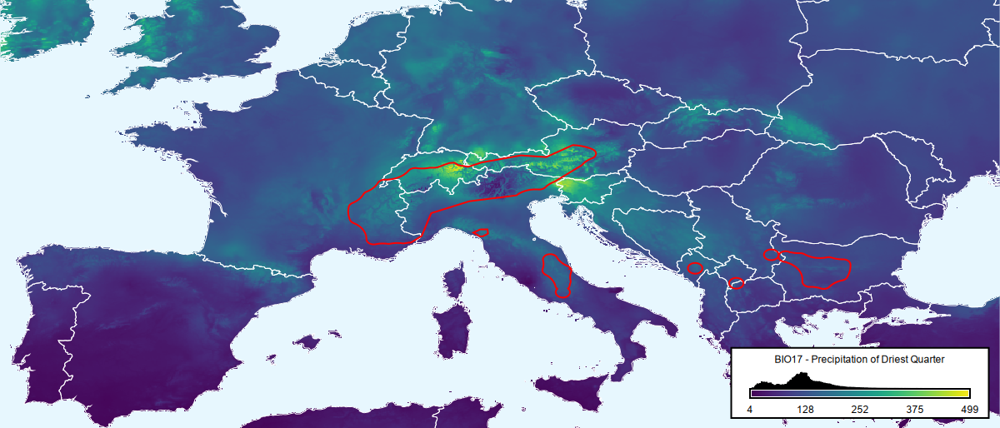{group="NsFOs6E8BO"}

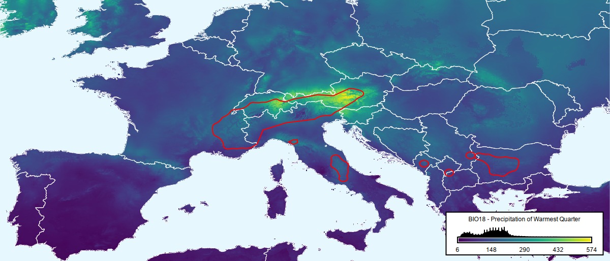{group="NsFOs6E8BO"}

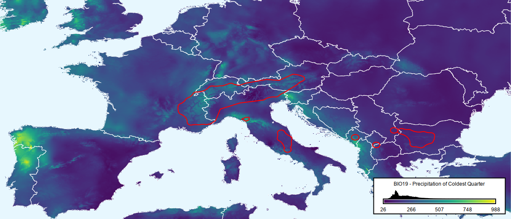{group="NsFOs6E8BO"}

Projected bioclimatic conditions for the period 2081-2100 based on the SSP585 from the GCM EC-Earth3-Veg. Source: [Worldclim version 2.0](https://www.worldclim.org/data/bioclim.html). The red outlines show the distribution of the Almond-eyed Ringlet butterfly according to the [IUCN Red List](https://www.iucnredlist.org/species/173278/6984115). Click on the image to enlarge and view the maps in detail.
:::

<br><br>

## Footnotes {.unlisted .unnumbered .hidefootnotes}
