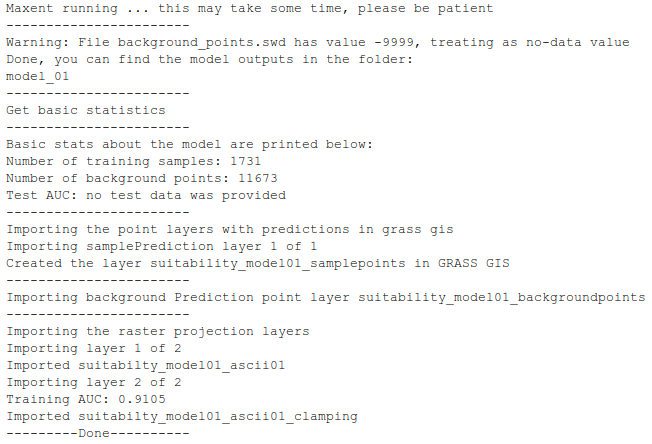
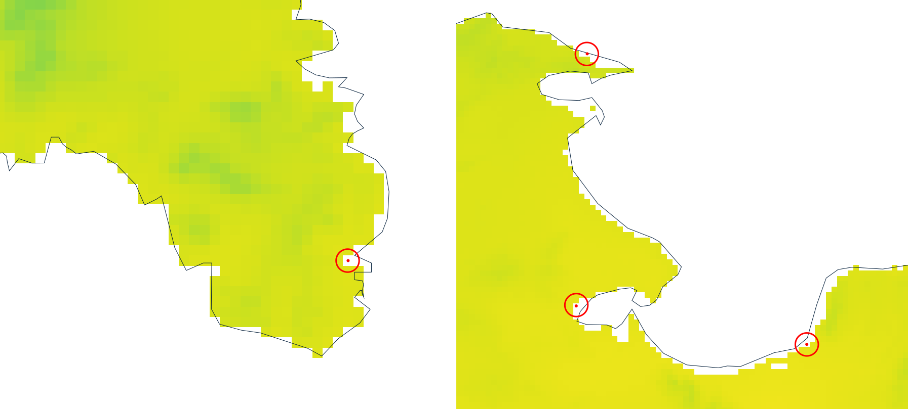
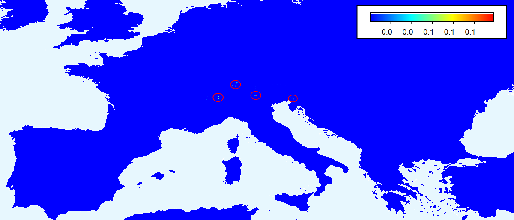
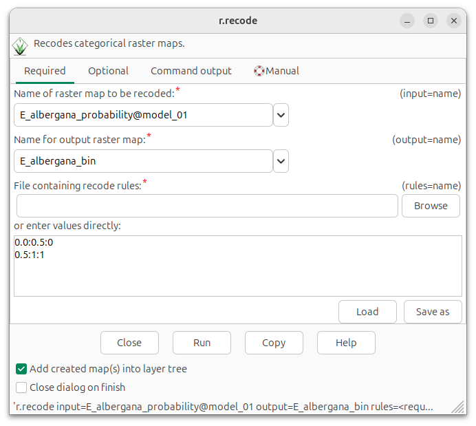
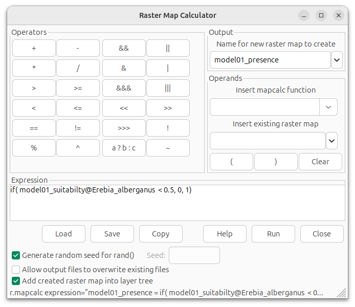
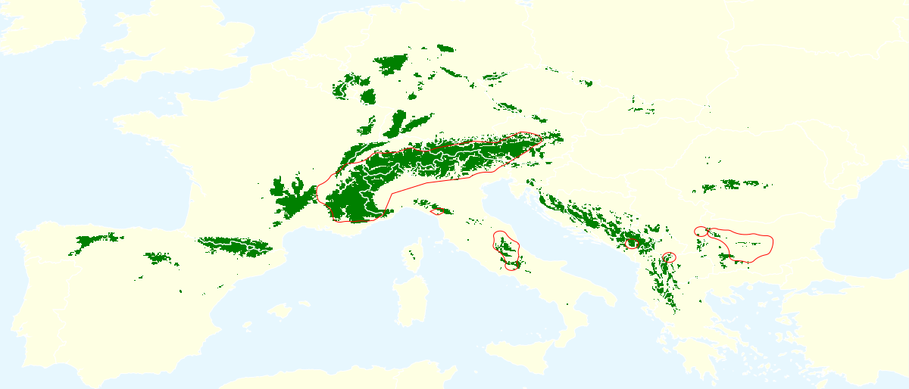
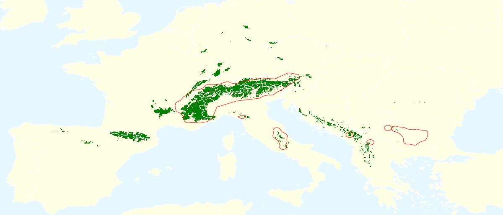
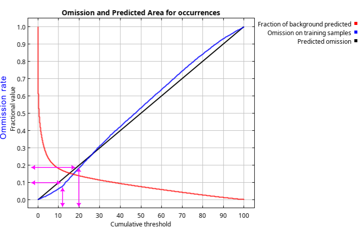
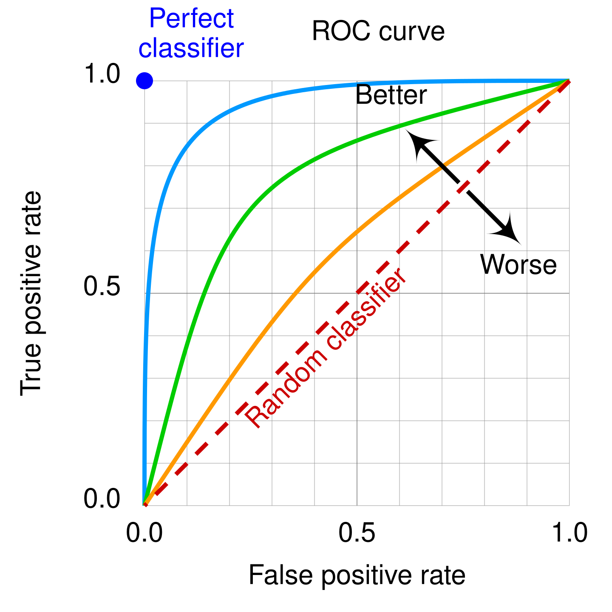

# Model training {#sec-modeltraining}

This chapter introduces the essential modules and workflows involved in building a species distribution model. To keep the workflow transparent and accessible, we primarily use default parameter settings. More advanced topics are addressed in later chapters, including methods for validating model results (paragraph [-@sec-modelvalidation]) and approaches for fine-tuning model options (paragraph [-@sec-modelfinetuning]).

![This chapter focuses on developing a species distribution model (A). In the next chapter, we'll use this model to predict the potential distribution of a species under future climate conditions (B). Note that while we will generate some prediction layers in pararaph [-@sec-4probabilitymaps]. These are intended primarily for evaluating the model's performance.](images/Flowchart_model_predict1.png){#fig-Flowchartmodelpredict width="450" fig-align="left"}

In this chapter, we use the [r.maxent.train](https://grass.osgeo.org/grass-stable/manuals/addons/r.maxent.train.html) addon to create several species distribution models based on different input data and parameter settings. It is good to reiterate that `r.maxent.train` runs the *Maxent* application in the background. In this tutorial, we cover some of the results, but for a deeper understanding, refer to the tutorial and other essential resources available on the [Maxent website](https://biodiversityinformatics.amnh.org/open_source/maxent/).

## Organize outputs {#sec-4organizeoutputs}

Each time we train a model, the module creates several output files and GRASS layers. To keep our work organised, we will create a separate subfolder in the working directory to store the model results. We call this folder [model_01]{.style-data}.  

All GRASS layers produced by the model are stored in the mapset [Erebia_alberganus]{.style-data}. So, switch to that mapset if needed.

::: {#exm-qvd5XNQcBw .hiddendiv}
:::

::: {.panel-tabset group="interface"}
## 

``` bash
# Set working directory
cd replace-for-path-to-working-directory

# Create a new sub-folder to store the model output
mkdir model_01

# We switch to the mapset in which we want to store the results
g.mapset mapset=Erebia_alberganus

# Set the region
g.region raster=bio_1@climate
```

## 

``` python
# Set working directory and create a new folder in the working directory
os.chdir("replace-for-path-to-working-directory")
os.makedirs("model_01", exist_ok=True)

# Create a new mapset and switch to it
gs.run_command("g.mapset", mapset="Erebia_alberganus")

# Set the region and create a MASK
gs.run_command("g.region", raster="bio_1@climate")
```

## 

Open your file explorer, go to your working directory, and create a new folder in your working directory. Give it the name [model_01]{.style-data}.

In GRASS, go to the menu [Settings →  GRASS working environment → Change working directory]{.style-menu} and select the working directory.

In case you are not in the mapset [Erebia_alberganus]{.style-data}, switch to it using the menu. Alternatively, open the `g.mapsets` dialog and run it with the following parameter settings:

| Parameter                             | Value    |
|---------------------------------------|----------|
| Name of mapset (mapset)               | Erebia_alberganus |

<br>Next, use the `g.region` module to set the computational region style parameter, based on the [bio_1]{.style-data} raster layer in the [climate]{.style-data} mapset.

| Parameter                   | Value                  |
|-----------------------------|------------------------|
| raster | bio_1\@climate |
:::


## Train the model {#sec-4trainthemodel}

MaxEnt offers a variety of training, validation, and output options. For now, we can rely on the default settings for most of these parameters. The parameters that we will define ourselves are listed below.

- The names of the files containing the species location data and background points. These are the SWD files created in @exm-ddddddwdr. 
- The path to the folder where MaxEnt will save the results. This is the folder [model_01]{.style-data} that we created im @exm-qvd5XNQcBw.
- Name of the new point layer with sample points with predicted suitability scores. We name it [model01_suitability_samplepoints]{.style-data}. 
- Name of the new point layer with background points with predicted suitability scores. We name it [model01_suitability_backgroundpoints]{.style-data}
- Name of the raster layer with the predicted suitability score. We call this layer [model01_suitability]{.style-data}. 

We’ll use a few additional parameters or flags, which are explained in the  tab. We'll go into more detail in the next section when we examine the results. For additional information, see the [manual page](https://grass.osgeo.org/grass-stable/manuals/addons/r.maxent.train.html) of the module.

::: {#exm-g8jUY2JKvW .hiddendiv}
:::

::: {.panel-tabset group="interface"}
## 

``` bash
r.maxent.train -ybg samplesfile=model_input/swd01/species.swd environmentallayersfile=model_input/swd01/background_points.swd projectionlayers=model_input/ascii01 outputdirectory=model_01 samplepredictions=model01_suitability_samplepoints backgroundpredictions=model01_suitability_backgroundpoints predictionlayer=model01_suitability threads=4 memory=1000 suffix=""
```

## 

``` python
gs.run_command(
    "r.maxent.train",
    flags="ybg",
    samplesfile="model_input/swd01/species.swd",
    environmentallayersfile="model_input/swd01/background_points.swd",
    projectionlayers="model_input/ascii01",
    outputdirectory="model_01",
    samplepredictions="model01_suitability_samplepoints",
    backgroundpredictions="model01_suitability_backgroundpoints",
    predictionlayer="model01_suitability",
    threads=4,
    memory=1000,
)  
```

## 

Open the `r.maxent.train` dialog and run the module with the following parameter settings:

| Parameter | Value |
|----|----|
| samplesfile | model_input/swd01/species.swd |
| environmentallayersfile | model_input/swd01/background_points.swd |
| projectionlayers | model_input/ascii01 |
| outputdirectory | model_01 |
| samplepredictions | model01_suitability_samplepoints |
| backgroundpredictions | model01_suitability_backgroundpoints |
| predictionlayer | model01_suitability |
| threads | 4 |
| memory | 1000 |
| Create a vector point layer from the sample predictions (y) | ✅ |
| Create a vector point layer with predictions at backgr. points (b) | ✅ |
| Create response curves (g) | ✅ |

: {tbl-colwidths="\[63,37\]"}

<br>Tip: if you are using the r.maxent.train dialog screen, keep it open after it finishes. That way, for the next run, you only need to adjust some parameter settings instead of typing in all again.

## 

[samplesfile]{.style-parameter}: The (relative) path to the [species swd]{.style-data} file.

[environmentallayersfile]{.style-parameter}: The (relative) path to the [background swd]{.style-data} file.

[projectionlayers]{.style-parameter}: The (relative) path to the folder that holds the ascii raster layers of the input environmental variables. If you select these, Maxent will first create the model, and then use the ascii layers as input in the model to create a prediction raster layer. See also point 8.

[outputdirectory]{.style-parameter}: The (relative) path to the folder where Maxent should write the results. This is the folder we created in the previous step.

[samplepredictions]{.style-parameter}: The module will create a point layer with the locations of species occurrences used for the model. The attribute table contains the predicted probability scores. With this parameter, you can specify a custom name for this point layer. If left empty, a default name will be used, based on the species name, with as suffix *samplePredictions*

[backgroundpredictions]{.style-parameter}: The module will create a vector layer with background points used as input for this model. The attribute table contains the predicted probability scores. With this parameter, you can specify a custom name for the layer. If left empty, a default name will be used, based on the species name, with as suffix *backgroundPredictions*.

[predictionlayer]{.style-parameter}: If the [projectionlayers]{.style-parameter} is set, a raster prediction layer will be created that reflects the potential distribution based on the projection layers. With the parameter [predictionlayer]{.style-parameter}, you can set the name of this output layers. If left empty, a default name will be used, based on the species name, with as suffix the name of the folder with the environmental raster layers. In this case, that would have been *Erebia_alberganus_obs_envdat*.

[threads]{.style-parameter}: To improve the performance, you can increase the number of threads. However, before making adjustments, check your system specifications and adjust the settings based on your system’s capabilities.

[memory]{.style-parameter}: Improve performance by allocating more memory. However, before making adjustments, check your system specifications and adjust the settings based on your system’s capabilities.

[-y]{.style-parameter}: Create a point feature layer with for each occurrence point the predicted probability score. This can be useful to identify discrepancies between the observed and predicted distribution.

[-b]{.style-parameter}: Create a vector point layer with predicted probability scores for the background point locations. This is useful to identify discrepancies between the observed and predicted distribution.

[-g]{.style-parameter}: Create response curves, which visualize the (marginal) effect of each explanatory variable on the predicted probability. 

:::

Depending on how you run the module, it will generate some information in the terminal, console, Python console, or the function's command output window (we will refer to any of these as the *console*). It also creates a number of files in the output directory you specify, and layers in the current mapset. We will look at these results in the next section.

::: {.callout-tip appearance="simple"}
If training the model seems to take forever, see @sec-toomanypresencepoints for possible solutions.
:::

## Examine the results {#sec-4examinetheresults}

The `r.maxent.train` modules shows a few messages on the console for a quick inspection of the results. This includes the main steps it has been carrying out, and a few basic statistics, like the AUC and number of sample and background points. (@fig-modeltrainconsulemessages01).

{#fig-modeltrainconsulemessages01 fig-align="left" width="600"}

::: {.callout-tip appearance="simple"}
Keep in mind that your evaluation statistics, including the AUC, may vary slightly from what is presented here. These statistics depend partly on the background points, which are selected randomly. As a result, your background points—and thus your evaluation statistics—may vary.
:::

The first message is a warning indicating that the background.swd file contains [-9999]{.style-ouput} values, which represent *no data*. This suggests that one or more background points fall outside the area covered by the Bioclim raster layers. A comparison of the background points and the Bioclim layers confirms that some points are indeed located just out of the coast in the sea.

:::: {.panel-tabset .exercise}
## 

::: {#exr-3_1}
Can you explain what went wrong here?
:::

## 

The background points were generated within the boundaries of a vector layer representing European countries. The bioclim layers contain values for land areas only. The boundaries of these land areas do not perfectly match those of the European countries layer (@fig-outsidebioclim).

{#fig-outsidebioclim fig-align="left"}

To address this mismatch, we can use one of the bioclim layers to create the MASK, instead of using the vector layer of European countries.
::::

The module prints a few basic statistics to the console. These are the number of training samples, the number of background points, and the the training AUC.

:::: {.panel-tabset .exercise}
## 

::: {#exr-3_1}
We created and used 10,000 background points as input. So where do these 11673 points come from?
:::

## 

By default, Maxent adds the presence points to the background points. You can disable this with the [-n]{.style-parameter} flag.

Still, the presence + original background points do not add up to the number reported here; that would have been 11731 points. This is because Maxent ignores presence points if there is already a background point at that location. 

It might seem a remarkable coincidence if a randomly generated background point fell exactly on a presence point. However, recall how the background points were created. They were generated by randomly selecting raster cells and placing a point at the centre of each selected cell. In addition, during thinning, all presence points were also moved to the centre of the raster cell in which they occur. As a result, the two points do not need to share identical coordinates. It is sufficient that both fall within the same raster cell.

::::

The Area Under the Receiver Operator Curve (AUC) is a common metric for evaluating species distribution model (SDM) performance. Here, we are provided with the training AUC, calculated using the same presence and background points that were used to train the model. Note that as we'll discuss in [chapter -@sec-modelvalidation], evaluating a model with the same data used for training often leads to overly optimistic results, and models should really be evaluated using an dataset that was not used during training.

::: {.callout-tip appearance="simple" collapse="true"}
## AUC of presence only models 
The AUC normally compares the portion of correctly classified known **presence** points, known as the sensitivity of the model, and the portion of **absence** points that were classified as presence. In presence-only models like Maxent, there are no absence points. So the ROC compares the portion of correctly classified presence points with the fraction of **background** points that is predicted to be present (1- specificity, or fractional predicted area).
:::

The AUC represents the probability that a randomly selected presence location ranks higher than a randomly selected background point. An AUC of [0.9105]{.style-output} suggests that the model has a fairly good predictive ability for species distribution.

::: {.callout-tip appearance="simple" collapse="true"}
## Interpreting the AUC value 

AUC values range from 0 to 1, with certain threshold interpretations commonly applied: values below 0.5 indicate the model is performing worse than random chance. Values between 0.5 and 0.7 typically suggest poor model performance, values from 0.7 to 0.9 suggest reasonable performance, and values above 0.9 are generally considered good. However, these thresholds should be interpreted cautiously and not used at face value.

It is important to realize that the AUC doesn’t account for the prevalence of presence points in your dataset. In fact, you can increase the AUC simply by adding more background points. Try this for yourself: create a new point layer with 50,000 background points and run the r.maxent.train module again with the same settings. See how this affects the AUC value. It means that AUC should only be used to compare models with a similar ratio of presence to background points.

:::

### Probability maps {#sec-4probabilitymaps}

The [occurrences.html]{.style-data} file in the output folder [model_01]{.style-data} provides more evaluation statistics, including a short explanation of the results. Before reviewing these, let's examine the sample prediction, background prediction, and raster prediction layers. In GRASS, go to the [data]{.style-menu} panel, and double click on each of them to open them in the [Map display]{.style-menu} panel.

::: {.panel-tabset .exercise}
## Suitability sample points

![The [suitability_model01_samplepoints]{.style-data} vector layer with the GBIF occurrences. The colors in this layer represent the predicted probability that the species occurs at these locations, based on model_01.](images/model01_suitability_samplepoints.png){#fig-samlepredmodel01 group="DMu5ABe7FD"}

The map in @fig-samlepredmodel01 shows the predicted probability that *Erebia alberganus* occurs at each observed location, allowing us to assess where the model accurately predicts suitable conditions and where it incorrectly suggests less or no suitable conditions. Notable examples of the latter include several occurrence points in Bulgaria. A follow up step would be to compare these predictions with maps of relevant environmental data layers or examining the GBIF source data for these observations more closely.

## Suitability background points

![The [suitability_model01_backgroundpoints]{.style-data} vector layer with the locations of the background points. The colors in this layer represent the predicted probability of the occurrence of the species at these locations, based on model_01.](images/model01_suitability_backgroundpoints.png){#fig-bgrpredmodel01 group="DMu5ABe7FD"}

The map in @fig-bgrpredmodel01 shows the predicted probability of *Erebia alberganus* to occur at individual background point locations, providing similar information to @fig-probdistmodel01, but with a different presentation. Depending on your needs / preferences, you may want to have the module generate one of these maps.

## Probability raster

![The raster layer [suitability_model01]{.style-data} with the predicted probability of occurrences of *Erebia_alberganus*, based on model_01.](images/model01_suitability.png){#fig-probdistmodel01 group="DMu5ABe7FD"}

The map in @fig-probdistmodel01 shows the predicted probability of presence of *Erebia_alberganus* within the bounds of the study area. As expected, probability scores are high in most areas where the species has been observed. However, there are additional areas where predicted probability scores are also high, most notably in Bosnia and Herzegovina and Montenegro. We will not attempt to explain these differences here, as that analysis is beyond the scope of this tutorial, but it is clear that these results warrant further investigation.

## Clamping map

{#fig-clampingmodel01 group="DMu5ABe7FD"}

Clamping restricts environmental variables and features to the range of values found in the training data. For example, if the input raster layer for [bio_1]{.style-variable} (annual mean temperature) has a value of 35°C, but the highest temperature among the training points is 32°C, all [bio_1]{.style-variable} values above 32°C are clamped to 32°C. This prevents the model from extrapolating beyond the conditions observed during training and ensures that predictions remain within the range of known environmental conditions. 

The clamping raster layer give the absolute difference in predictions when using clamping vs not using clamping. Higher values on the map indicate areas where clamping is likely to have a greater effect on predicted fitness.

The clamping map is particularly useful for examining how well the background points cover the environmental conditions. In this case, the clamping is limited to a few small areas (outlined in red). These include some mountain tops and other small mountainous areas. This limited clamping is not surprising given the environmental heterogeneity typical of mountain areas. However, the extent of these regions is minimal, so no further adjustments are done at this stage.
:::

Note that Maxent supports four output formats for model value: [raw]{.style-parameter}, [logistic]{.style-parameter} and [cloglog]{.style-parameter}. We used the default output, which is *cloglog*. It represents the probability of presence, and has a value between 0 and 1. Importantly, one should be aware that the scores strongly depends on details of the sampling design [@phillipsOpeningBlackBox2017a].

### Presence-absence {#sec-4presenceabsence}

While a probability distribution map shows the likelihood of species occurrence across a landscape, it can also be useful to convert this map into a binary presence-absence map. To do this, you need to convert the probability values, which range between 0 and 1, into binary values of 0 (absent) and 1 (present). This is done by selecting a threshold: all cells with a probability above this threshold are classified as 1 (presence), and all others as 0 (absence). We can for example use a threshold of 0.5 to convert the probability map to a presence-absence map. There are several ways to accomplish this conversion.

The [r.mapcalc](https://grass.osgeo.org/grass-stable/manuals/r.mapcalc.html) module is a versatile and powerful tool for this kind of raster calculation, while the [r.recode](https://grass.osgeo.org/grass-stable/manuals/r.recode.html) module might be slightly faster for simple thresholding operations. Below, both methods are demonstrated for comparison.

::: {#exm-dfadecdrlp .hiddendiv}
:::

::: {.panel-tabset group="interface"}
## 

One option is to use `r.recode`. Check out the function's [help page](https://grass.osgeo.org/grass-stable/manuals/r.recode.html) for an explanation of the recode rules.

``` bash
r.recode input=model01_suitability output=model01_presence rules=- << EOF
0.0:0.5:0
0.5:1:1
EOF
```

Or use r.mapcalc

``` bash
r.mapcalc expression="model01_presence = if(model01_suitability < 0.5,0,1)"
```

## 

One option is to use `r.recode`. Check out the function's [help page](https://grass.osgeo.org/grass-stable/manuals/r.recode.html) for an explanation of the recode rules.

``` python
rules = "0.0:0.5:0\n0.5:1:1"
gs.write_command(                         # <1>
    "r.recode",
    input="model01_suitability",
    output="model01_presence",
    rule="-",
    stdin=rules,
)
```

1.  Note that we need to use the `gs.write_command` because we are using [stdin]{.style-parameter} parameter.

Or use r.mapcalc

``` python
gs.run_command(
    "r.mapcalc", expression="model01_presence = if(model01_suitability <0.5,0,1)"
)
```

## 

One option is to use `r.recode`. Check out the function's [help page](https://grass.osgeo.org/grass-stable/manuals/r.recode.html) for an explanation of the recode rules.

{#fig-rrecodeprob2bin fig-align="left"}

Or use the `r.mapcalc` module. You can find this in the menu [raster → raster map calculator → raster map calculator]{.style-menu}

{#fig-rmapcalctoconvertprob2bin fig-align="left"}
:::

The challenge is to choose the best threshold. The answer is the perhaps unsatisfactory "it depends". Setting a lower threshold will classify more cells as "present", which means the model will correctly identify more actual presence locations (more true positives). However, this also increases the likelihood of predicting the species in areas where it may not actually occur (more false positives). Conversely, a higher threshold will make the model more conservative, classifying fewer cells as "present". This reduces false positives, but also means that many areas where the species actually occurs may be missed (increasing false negatives).

The best threshold depends on your priorities: whether it's more important to maximize sensitivity (identifying all areas where the species might occur) or specificity (ensuring that areas predicted to be suitable are actually suitable). [Table -@tbl-tresholdvalues_model01], which comes from the file [occurrences.html]{.style-data} in the output folder, shows some common thresholds and the corresponding omission rates and fraction of the study area that would be classified as suitable based on that threshold. See the Maxent manual and references for an explanation of these thresholds.

::: {.panel-tabset .exercise}
## Threshold values

| Cumulative threshold | Cloglog threshold | Description | Fractional predicted area | Training omission rate |
|----|----|:---|----|----|
| 1.000 | 0.021 | Fixed cumulative value 1 | 0.435 | 0.005 |
| 5.000 | 0.107 | Fixed cumulative value 5 | 0.241 | 0.027 |
| 10.000 | 0.296 | Fixed cumulative value 10 | 0.180 | 0.063 |
| 0.008 | 0.000 | Minimum training presence | 0.843 | 0.000 |
| 13.463 | 0.415 | 10 percentile training presence | 0.160 | 0.100 |
| 17.126 | 0.512 | Equal training sensitivity and specificity | 0.146 | 0.146 |
| 8.982 | 0.254 | Maximum training sensitivity plus specificity | 0.188 | 0.053 |
| 3.610 | 0.070 | Balance training omission, predicted area and threshold value | 0.278 | 0.016 |
| 4.939 | 0.106 | Equate entropy of thresholded and original distributions | 0.242 | 0.027 |

: Threshold values and corresponding fractional predicted area and omission rate values. The tabs on the right show the resulting maps for three of these thresholds. {#tbl-tresholdvalues_model01 tbl-colwidths="\[15,15,40,15,15\]"}

## 0.254

{#fig-thr2 fig-align="left" group="presabs"}

## 0.296

{#fig-thr3 fig-align="left" group="presabs"}

## 0.512

{#fig-thr4 fig-align="left" group="presabs"}
:::

Comparing the predicted distribution with the IUCN Red List range map highlights several discrepancies. In some areas, the range map boundaries appear slightly shifted, while in others they seem overly optimistic. The question is whether this is due to unaccounted for variables or indicates a decline of the species' presence in these areas. Notably, there are the extensive areas with similar climate conditions where the species has not been recorded according to GBIF data. This suggests that factors other than those used in the model may play a critical role in determining the distribution of the species.

### Evaluation statistics {#sec-4evalstats}

To determine how good the model is at predicting the presence of a species, Maxent generates some model evaluation statistics. To do this, it converts the probability map to a binary map using a range of threshold values from 0 to 1. Each time, the number of presence points correctly classified, the number misclassified as absence, and the number of background points classified as either presence or absence are calculated. The resulting statistics serve as input for the calculation of standard validation metrics such as the area under the receiver operating characteristic curve ([AUC-ROC](https://en.wikipedia.org/wiki/Receiver_operating_characteristic)). The results, which can be found in the file [occurrences.html](share/model_01/occurrences.html){target="_blank"} in the output folder, are briefly discussed below.

::: {.panel-tabset .exercise}
## AUC-ROC

The ROC plot compares the proportion of correctly classified presence points, known as the sensitivity of the model, with the proportion of background points classified as presence. This comparison is made across a range of presence probability cutoff values between 0 and 1. The closer the ROC curve is to the upper left corner, the larger the area under the curve (AUC), and the better the model performance[^4_model_training-16]. In other words, the AUC provides a threshold-independent estimate of the predictive power of the model. As we have seen before, the AUC for our model is 0.911.

{#fig-rocauc fig-align="left" group="qmXR1UJHFa"}

A ROC curve below the black line indicates that the model performs worse than a random model would. It is important to reiterate that AUC values tend to be higher for species with narrow ranges, relative to the study area described by the environmental data.

## Omission graph

The *omission and predicted area* graph (@fig-commissiongraph) illustrates how the proportion of presence points incorrectly classified as absence (omission - blue line) and the fraction of background points predicted as suitable (red line) vary with the choice of cumulative threshold. Note that the x-axis shows the cumulative raw threshold values[^4_model_training-17]. We see that the omission matches the expected omission rate (black line) closely.

{#fig-commissiongraph fig-align="left" group="qmXR1UJHFa"}

## 

Note that Maxent uses random background points rather than true absence points. Since the background points don't exclusively represent areas where the species is absent but rather a sample of the entire study area, there's a degree of overlap between conditions at presence and background points. This overlap limits the model's ability to perfectly separate the two classes, meaning that the AUC will typically be less than 1. In contrast, if true absences were available and clearly distinct from presences, a higher maximum AUC could theoretically be achieved.
:::

[^4_model_training-16]: 

[^4_model_training-17]: So to be clear, it does not use the cloglog values. In the file that ends with [\_omission.csv]{.style-data} (in our case, this is the file [OCCURRENCES_omission.csv]{.style-data}), you can find for each raw value the corresponding cloglog value. In @tbl-relativeimportance some key treshold values are provided (both the raw and cloglog variants) with the corresponding omission values.

### Variable importance {#sec-4variableimportance}

A natural application of species distribution modeling is to answer the question, "Which variables are most important for the species being modeled? There is more than one way to answer this question.

While the Maxent model is being trained, it keeps track of which environmental variables are contributing to fitting the model. This is at the end of the training process converted into an estimate of the relative contribution of each variable to the model. This is expressed as a *percentage contribution*. The higher the percentage, the more important that variable is for the model. This is somewhat equivalent to the coefficients of a regression model. Like the regression coefficients, when the environmental variables are highly correlated environmental variables, the percent contributions should be interpreted with caution.

| Variable | Percent contribution | Permutation importance |
|:---------|----------------------|------------------------|
| bio_1    | 51.8                 | 33.6                   |
| bio_4    | 24.8                 | 32.8                   |
| bio_8    | 13.3                 | 0.5                   |
| bio_13   | 3.5                  | 14.9                   |
| bio_14    | 2.4                  | 0.9                    |
| bio_9   | 1.6                  | 1.6                    |
| bio_19    | 1.2                  | 4.6                    |
| bio_15   | 0.9                  | 10.6                    |
| bio_2   | 0.5                  | 0.5                   |

: Relative importance of the explanatory variables. The table is presented in the section 'Analysis of variable contributions' of the file [occurrences.html]{.style-data} in the output folder {#tbl-relativeimportance tbl-colwidths="\[33,33,33\]"}

The other metric is the *Permutation importance*. The contribution for each variable is determined by randomly permuting the values of that variable among the training points (both presence and background) and measuring the resulting decrease in training AUC. A large decrease indicates that the model depends heavily on that variable. Values are normalized to give percentages.

### Response curves {#sec-4responsecurves}

The HTML file [occurrences.html]{.style-data} also includes a section with two types of response curves. Both show how each environmental variable affects the prediction of the species probability distribution. Note that you can click on a plot for a larger and more detailed image[^4_model_training-18].

[^4_model_training-18]: We have attempted to reduce the issue of multi-collinearity using the stepwise VIF procedure (@sec-multicollinearity). But the results suggest that this did not solve all problems.

The first set of curves (@fig-responsecurves1) illustrates how the predicted probability of presence changes when each environmental variable is varied individually, while keeping all other variables fixed at their average sample value. These are known as *marginal response curves*. They indicate, for example, that the species prefers cooler areas, with a mean annual temperature ([bio_1]{.style-variable}) below 5°C, or a temperature seasonality around 600, corresponding to a standard deviation of monthly temperatures close to 6°C.

The curves in @fig-responsecurves2 represent different models, where each model is built using only the corresponding environmental variable. These curves can be more straightforward to interpret when there are strong correlations between variables.

::::: {.panel-tabset .exercise}
## Marginal response curves

::: {#fig-responsecurves1 layout-ncol="4"}
{group="hbhHpuMH7S"}

{group="hbhHpuMH7S"}

{group="hbhHpuMH7S"}

{group="hbhHpuMH7S"}

{group="hbhHpuMH7S"}

{group="hbhHpuMH7S"}

{group="hbhHpuMH7S"}

{group="hbhHpuMH7S"}

Response curves created by varying the specific variable, while keeping all other variables fixed at their average sample value.
:::

## single-variable response curves

::: {#fig-responsecurves2 layout-ncol="4"}
{group="d5aRYc7tfLd"}

{group="d5aRYc7tfLd"}

{group="d5aRYc7tfLd"}

{group="d5aRYc7tfLd"}

{group="d5aRYc7tfLd"}

{group="d5aRYc7tfLd"}

{group="d5aRYc7tfLd"}

{group="d5aRYc7tfLd"}

Response curves created by running a model based on only the specific variable as explanatory variable.
:::
:::::

These two types of curves can sometimes yield conflicting insights. Click between the tabs to compare them. For instance, the marginal response curve for precipitation of the driest month ([bio_14]{.style-variable}) suggests a negative relationship between this variable and the predicted probability of presence. In other words, when all other variables are held constant, an increase in precipitation during the driest month reduces the predicted probability of presence.

In contrast, the single-variable response curve for [bio_14]{.style-variable} shows the opposite trend: as precipitation increases, the predicted probability of presence also rises. This discrepancy likely arises because [bio_14]{.style-variable} is correlated with other precipitation-based variables[^4_model_training-19]. Consequently, when environmental variables are correlated, marginal response curves can sometimes be misleading. 

A similar situation can occur when two strongly correlated variables have nearly opposite response curves. Their combined effect may then be close to zero across most of the study area, even though each variable appears influential when considered in isolation.

[^4_model_training-19]: We have attempted to reduce the issue of multi-collinearity using the stepwise VIF procedure (@sec-multicollinearity). But the results suggest that this did not solve all problems.

Therefore, it’s advisable to examine and compare both sets of curves for a clearer understanding. For further details and examples, see the [Maxent tutorial](https://biodiversityinformatics.amnh.org/open_source/maxent/).

### Raw data

At the end of the HTML file [occurrences.html](share/model_01/occurrences.html){target="_blank"}, you'll find a summary of the model input data and parameter settings. In addition, links are provided to various files in your output folder with model settings, predictions at presence and background point locations and summary statistics. This allow you to further analyse the model outcomes using other tools such as R. Some examples are provided in the [Maxent tutorial](https://biodiversityinformatics.amnh.org/open_source/maxent/).

<br><br>

## Footnotes {.unlisted .unnumbered .hidefootnotes}
