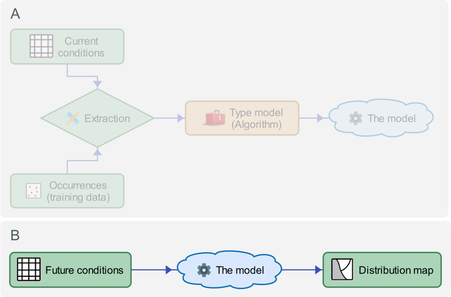
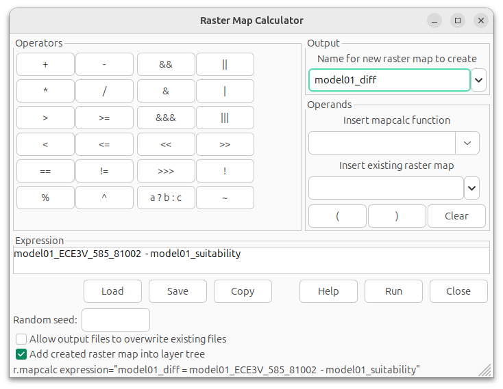
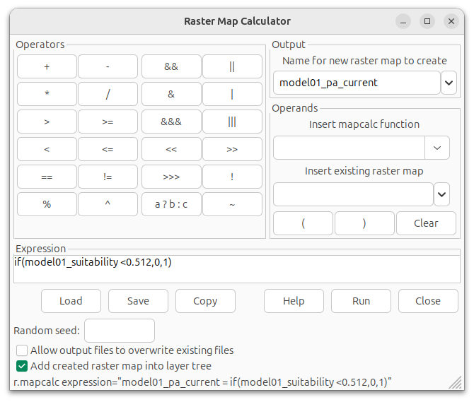
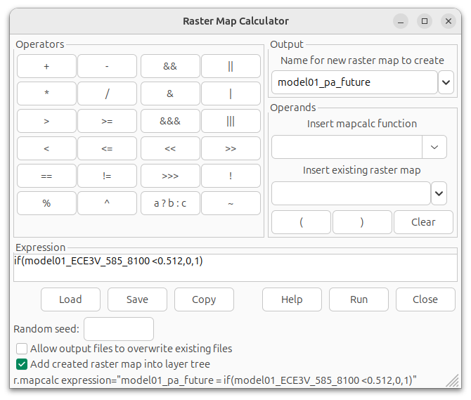
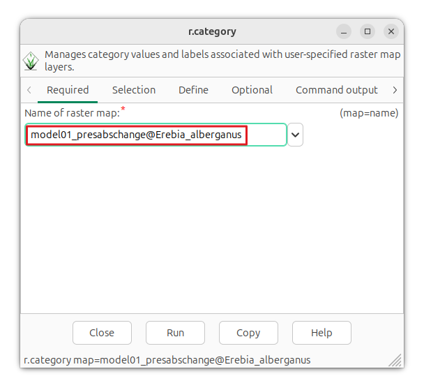
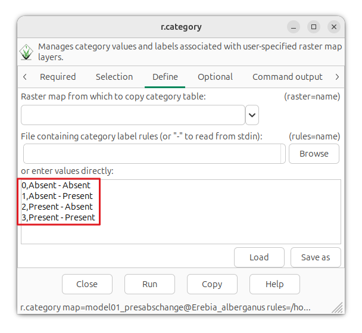
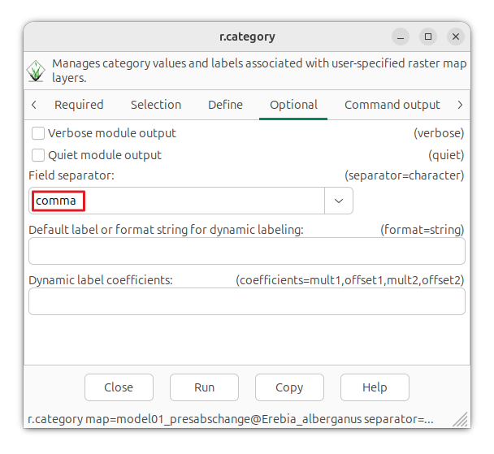

# Model prediction {#sec-modelprediction}

A species distribution model trained on a given set of environmental variables can be projected onto future climate scenarios to estimate potential changes in habitat suitability over time (@fig-Flowchartmodelpredict2). This is done by applying the same variables used during model training, but represented by layers that describe future environmental conditions.

In a similar way, a model calibrated on a species’ native range can be transferred to other regions to estimate where the species might establish outside its current distribution. Such projections can for example be used to assess the potential risk of biological invasions.

{#fig-Flowchartmodelpredict2 width="450" fig-align="left"}

In this section, we’ll use the model developed in @sec-4trainthemodel to project the current and the future potential distribution of the Almond-eyed Ringlet.

## Current distribution {#sec-WZPnHz9gkh}

When we ran the `r.maxent.train` command in @sec-4trainthemodel, we used the [predictionlayer]{.style-parameter} parameter to create a habitat suitability map (a probability distribution map) for current conditions. We can produce the same type of output in a separate step using the r.maxent.predict add-on. Let's try it out, the result should be the same. 

The minimum input requirements of `r.maxent.predict` are the names of the input raster layers, the [lambdas]{.style-data} file and the raster layers corresponding to the predictor variables described in the lambdas file. The [lambdas]{.style-data} file, one of the outputs from the `r.maxent.train` module, can be found in the output folder [model_01]{.style-data}. It has the extension *.lambdas* and describes the Maxent model. We call the output layer [model01_suitability_v2]{.style-data}.

::: {#exm-VwlODGvXBe .hiddendiv}
:::

::: {.panel-tabset}
## 

``` bash
# Make sure you are working in the working directory
cd path_to_working_directory

# Create the future potential distribution map
r.maxent.predict lambda=model_01/occurrences.lambdas rasters=bio_1,bio_13,bio_14,bio_15,bio_19,bio_2,bio_4,bio_8,bio_9 output=model01_suitability_v2 memory=1000
```

## 

``` python
# Make sure you are working in the working directory
os.chdir("replace-for-path-to-working-directory")

# Create the future potential distribution map
gs.run_command(
    "r.maxent.predict",
    lambdafile="model_01/occurrences.lambdas",
    rasters="bio_1,bio_13,bio_14,bio_15,bio_19,bio_2,bio_4,bio_8,bio_9",
    output="model01_suitability_v2",
)
```

## 

Open the `r.maxent.predict` dialog and run it with the following parameter settings:

| Parameter  | Value                                                     |
|------------|-----------------------------------------------------------|
| lambdafile | model_01/occurrences.lambdas                    |
| rasters    | bio_1,bio_13,bio_14,bio_15,bio_19,bio_2,bio_4,bio_8,bio_9 |
| output     | model01_suitability_v2                                 |

: {tbl-colwidths="\[35,65\]"}

## 

Want to know more about what all these parameters are for, or what to fill in? Check out the addon's [manual page](https://grass.osgeo.org/grass-stable/manuals/addons/r.maxent.predict.html). 

:::

To confirm that the resulting map [model01_suitability_v2]{.style-data} is identical to the map [model01_suitability]{.style-data} that we created in @sec-4trainthemodel, we compute the difference between the two maps using the `r.mapcalc` module.

::: {#exm-iZAJ53ha7v .hiddendiv}
:::

::: {.panel-tabset}
## 

``` bash
r.mapcalc expression="diff = model01_suitability-model01_suitability_v2"
```

## 

``` python
gs.run_command(
    "r.mapcalc",
    expression="diff = model01_suitability-model01_suitability_v2",
)
```

## 

Run the [r.mapcalc]{.style-function} function with the following parameters:

| Parameter  | Value                                              |
|------------|----------------------------------------------------|
| Output     | diff                                               |
| Expression | model01_suitability-model01_suitability_v2 |

: {tbl-colwidths="\[35,65\]"}
:::

All raster cells in the diff map should have a value of zero. You can check this using the [r.univar](https://grass.osgeo.org/grass-stable/manuals/r.univar.html). Alternatively, check the metadata by right-clicking the layer in the [layer window]{.style-menu} and selecting [metadata]{.style-menu}).

The two layers are no longer needed; they were created only for this quick verification. In general, it is good practice to remove layers that you no longer need. This saves disk space and helps keep your GRASS database clear and easier to manage. We'll remove the layers with the [g.remove](https://grass.osgeo.org/grass-stable/manuals/g.remove.html) module.

::: {#exm-iZAJ53ha7v2 .hiddendiv}
:::

::: {.panel-tabset}
## 

``` bash
g.remove -f type=raster name=diff,model01_suitability_v2
```

## 

``` python
gs.run_command(
    "g.remove", flags="f", type="raster", name=["diff", "model01_suitability_v2"]
)
```

## 

Run the [g.remove]{.style-function} function with the following parameters:

| Parameter     | Value                                              |
|---------------|----------------------------------------------------|
| type          | raster                                             |
| name          | diff,model01_suitability_v2                        |
| Force removal | ✅                                                 |

: {tbl-colwidths="\[35,65\]"}
:::

## Future distribution {#sec-e8039LmOdu}

We will now use the same model as in the previous paragraph to project the future potential distribution of the almond-eyed ringlet butterfly for the period 2081–2100. The projection is based on the SSP585 climate scenario produced by the EC-Earth3-Veg general circulation model (GCM).

In @sec-obtainfutureclimatelayers, we already downloaded the corresponding future climate layers and stored them in the [climate]{.style-data} mapset. The raster layers were named [ECE3V_585_8100]{.style-data}, followed by the band number. Each band represents a bioclimatic variable, where band 1 corresponds to BIO1, band 2 to BIO2, and so on.

The `r.maxent.predict` parameter settings are similar to those used in the previous paragraph, with one exception: the raster names of the future climate layers do not match the variable names used to create the Maxent model. To address this, we use the [variables]{.style-parameter} parameter to provide the corresponding variable names. Note that they must be provided in the same order as the corresponding raster layers.

::: {#exm-CZnP5gebFx .hiddendiv}
:::

::: {.panel-tabset}
## 

``` bash
# Make sure you are working in the working directory
cd path_to_working_directory

# Create the future potential distribution map
r.maxent.predict lambda=model_01/occurrences.lambdas rasters=ECE3V_585_8100.1,ECE3V_585_8100.13,ECE3V_585_8100.14,ECE3V_585_8100.15,ECE3V_585_8100.19,ECE3V_585_8100.2,ECE3V_585_8100.4,ECE3V_585_8100.8,ECE3V_585_8100.9 variables=bio_1,bio_13,bio_14,bio_15,bio_19,bio_2,bio_4,bio_8,bio_9 output=model01_ECE3V_585_8100 memory=1000
```

## 

``` python
# Make sure you are working in the working directory
os.chdir("replace-for-path-to-working-directory")

# Create the future potential distribution map
gs.run_command(
    "r.maxent.predict",
    lambdafile="model_01/occurrences.lambdas",
    rasters="ECE3V_585_8100.1,ECE3V_585_8100.13,ECE3V_585_8100.14,ECE3V_585_8100.15,ECE3V_585_8100.19,ECE3V_585_8100.2,ECE3V_585_8100.4,ECE3V_585_8100.8,ECE3V_585_8100.9",
    variables="bio_1,bio_13,bio_14,bio_15,bio_19,bio_2,bio_4,bio_8,bio_9",
    output="model01_ECE3V_585_8100",
)
```

1.  The names of the future bioclim layers differ from the variables, so we need to provide the variable names. Note that they must be provided in the same order as the corresponding raster layers.

## 

Open the `r.maxent.predict` dialog and run it with the following parameter settings:

| Parameter  | Value                                                     |
|------------|-----------------------------------------------------------|
| lambdafile | model_01/occurrences.lambdas                              |
| rasters    | ECE3V_585_8100.1,ECE3V_585_8100.13,ECE3V_585_8100.14,ECE3V_585_8100.15,ECE3V_585_8100.19,ECE3V_585_8100.2,ECE3V_585_8100.4,ECE3V_585_8100.8,ECE3V_585_8100.9      |
| variables  | bio_1,bio_13,bio_14,bio_15,bio_19,bio_2,bio_4,bio_8,bio_9 |
| output     | model01_ECE3V_585_8100                                    |


## 

Instead of using the [rasters]{.style-parameter} and [variables]{.style-parameter} parameters, the [alias_file]{.style-parameter} parameter can be used to provide a CSV file with the names of the explanatory variables (first column) and the names of the corresponding raster layers (second column). See the addon's [manual page](https://grass.osgeo.org/grass-stable/manuals/addons/r.maxent.predict.html) for more information.


:::

We have now projected both the current and future potential distribution of the Almond-eyed Ringlet butterfly under different climate scenarios. Next step is to compare them.

## Current vs future distribution

### Comparing probability maps

There are several ways to compare the predicted current and future distributions of a species. We can start with a visual comparison of the probability maps. For such a comparison to be meaningful, both maps must use the same colour table.

To ensure this, we use the [r.colors](https://grass.osgeo.org/grass-stable/manuals/r.colors.html) module to assign a single colour table to both the current and future suitability layers. By providing the names of both raster maps to the [map]{.style-parameter} parameter, the colour table is scaled to the full range of values present across both layers. As [color]{.style-parameter}, we use the [viridis]{.style-values} colour table. 


::: {#exm-jsOr4IpXRP .hiddendiv}
:::

::: {.panel-tabset}
## 

``` bash
r.colors map=model01_suitability,model01_ECE3V_585_8100 color=viridis
```

## 

``` python
gs.run_command(
    "r.colors",
    map=["model01_suitability", "model01_ECE3V_585_8100"],
    color="viridis",
)
```

## 

Open the `r.colors` dialog and run it with the following parameter settings:

| Parameter | Value                                           |
|-----------|-------------------------------------------------|
| map       | model01_suitability,model01_ECE3V_585_8100     |
| color     | viridis                                         |

: {tbl-colwidths="\[35,65\]"}
:::

Examining the resulting map reveals that by 2081, the potential distribution area of the Almond-eyed Ringlet is projected to decrease significantly under SSP585 (compare @fig-probdistmodel01b with @fig-futdistr01 below). In the Alps, its range is expected to shift to higher altitudes, while in other areas, the species may dissapear entirely.


::: {.panel-tabset .exercise}
## Future climate conditions

![The raster layer [model01_ECE3V_585_8100]{.style-data} with the predicted probability of occurrences of *Erebia alberganus* in 2081-2100 under the SSP585 climate scenario, based on model_01.](images/E_alberganus_futprob.png){#fig-futdistr01 group="presfut"}

## Current climate conditions

![The raster layer [model01_suitability]{.style-data} with the predicted probability of occurrences of *Erebia alberganus*, based on model_01.](images/E_alberganus_probability.png){#fig-probdistmodel01b group="presfut"}
:::

To highlight areas where the changes are expected to happen, we can create a change map by calculating the differences in habitat suitability scores between current and future distributions.

::: {#exm-VjtxwilsRu .hiddendiv}
:::

::: {.panel-tabset}
## 

``` bash
# Calculate the change map
r.mapcalc expression="model01_diff = model01_ECE3V_585_8100 - model01_suitability"

# Assign a color table that emphasize differences
r.colors map=model01_diff color=differences
```

## 

``` python
# Calculate the change map
gs.run_command(
    "r.mapcalc",
    expression="model01_diff = model01_ECE3V_585_8100 - model01_suitability",
)

# Assign a color table that emphasize differences
gs.run_command("r.colors", map="model01_diff", color="differences")
```

## 

Open the `raster map calculator` from the [raster]{.style-menu} and run it with the following expression.

{#fig-rastmapchangemap fig-align="left"}

Next, open the `r.colors` module, and run it with the following parameters.

| Parameter | Value       |
|-----------|-------------|
| map       | model01_diff  |
| color     | differences |

: {tbl-colwidths="\[35,65\]"}
:::

The resulting map (@fig-changemap01) corroborates our earlier observations: across most of the study area, climate conditions are projected to become less suitable, whereas at higher elevations in the Alps, conditions may become increasingly favorable. Note that the map should be interpreted with caution, as it reflects only projected changes in climatic conditions and does not incorporate other potentially important factors.

{#fig-changemap01}

### Presence-absence maps

While the change map is useful for highlighting areas of change, it doesn’t indicate where conditions are, and will remain, unsuitable - or conversely, where they are and will remain suitable. 

Another way to approach this is to convert the probability maps to presence-absence maps, and subsequently compare these. We will call the presence-absence map based on current conditions [model01_pa_current]{.style-value} and for the future conditions [model01_pa_future]{.style-value}. 

::: {.aside}
**sensitivity**: The ability of the model to correctly identify presence locations, or true positives. </br>
**specificity**: For presence-only models this can be defined as the fraction of the background points predicted to be absent.
:::

We have already seen how to create presence-absence maps in [paragraph -@sec-4presenceabsence]. This time, we'll use the threshold value that balances the sensitivity and specificity, which is 0.512 (see @tbl-tresholdvalues_model01). 

::: {#exm-Yc5f3VPPR2 .hiddendiv}
:::

:::: {.panel-tabset}
## 

``` bash
# Convert the probability under current conditions
r.mapcalc expression="model01_pa_current = if(model01_suitability <0.512,0,1)"

# Convert the probability under future conditions
r.mapcalc expression="model01_pa_future = if(model01_ECE3V_585_8100 <0.512,0,1)"
```

## 

``` python
# Convert the probability to presence-absence under current conditions
gs.run_command(
    "r.mapcalc",
    expression="model01_pa_current = if(model01_suitability <0.512,0,1)",
)

# Convert the probability to presence-absence under future conditions
gs.run_command(
    "r.mapcalc",
    expression="model01_pa_future = if(model01_ECE3V_585_8100 <0.512,0,1)",
)
```

## 

Open the [raster map calculator]{.style-menu} in the menu [raster → raster map calculator → raster map calculator]{.style-menu}

::: {#fig-catcross layout-ncol="2"}
{#fig-presabscurrentbal fig-align="left" group="rmapcalc"}

{#fig-presabsfuturebal fig-align="left" group="rmapcalc"}

Convert current and future probability maps to binary maps using the r.mapcalc module.
:::

::::

After creating the presence-absence maps, we assign them a color table using the [r.colors](https://grass.osgeo.org/grass-stable/manuals/r.colors.html) module.

::: {#exm-297314PR2 .hiddendiv}
:::

:::: {.panel-tabset}
## 

``` python
# Assign white to absence (0) and green to presence (1)
r.colors map=model01_pa_current rules=- << EOF
0 white
1 green
EOF 

r.colors map=model01_pa_future rules=- << EOF
0 white
1 green
EOF 
```

## 

``` python
# Assign white to absence (0) and green to presence (1)
COLORS = "0 white\n1 green"
gs.write_command(
    "r.colors",
    map="model01_pa_current",
    rules="-",
    stdin=COLORS,
) 
gs.write_command(
    "r.colors", 
    map="model01_pa_future",
    rules="-",
    stdin=COLORS,
)
```

## 



## 

The command `r.colors` assigns colours to map values. It does not change the data itself, only how the map looks on screen or in exported figures.

For both maps ([model01_pa_current]{.style-data} and [model01_pa_future]{.style-data}), the same colour rules are applied:

* Cells with value 0 are shown in white. This represents predicted absence.
* Cells with value 1 are shown in green. This represents predicted presence.

 **Command line**

The option [rules]{.style=parameter}=[-]{.style-value} specifies where GRASS should read the colour rules from.
The dash (-) means that the colour rules are not read from an external file, but are instead provided directly in the command itself. 

These rules are written between [<< EOF]{.style-value} and [EOF]{.style-value}. GRASS interprets this block as a temporary rules file and applies the colour assignments line by line to the map values.

 **Python**

The colour rules are provided directly from the Python script via the [stdin]{.style-parameter} argument. By setting [rules="-"]{.style-parameter}, the `r.colors` module is instructed to read these rules from standard input rather than from an external file.

The function `gs.write_command()` is required in this situation (rather than `gs.run_command`) because it allows text to be passed to a GRASS module’s standard input. The rules themselves are stored in the [COLORS]{.style-parameter} variable and supplied through stdin. So, in practice, GRASS treats this input as if it were a temporary rules file. 

Note that the [\n]{.style-value} character means “end of line”. It ensures that the colour rules are provided as separate lines, as required by the r.colors module.
::::

We can now compare the two maps to identify four possible outcomes for the species distribution:

* present under both current and future conditions,
* present under current conditions but absent in the future,
* absent under current conditions but present in the future, and
* absent under both current and future conditions.

We use the [r.cross](https://grass.osgeo.org/grass-stable/manuals/r.cross.html) module to this. It generates a new raster by computing the cross product of category values from multiple input raster maps. Each unique combination of values is assigned a distinct category.

::: {#exm-ZRtKwPOjl3 .hiddendiv}
:::

::: {.panel-tabset}
## 

``` bash
r.cross -z input=model01_pa_current,model01_pa_future output=model01_presabschange
```

## 

``` python
gs.run_command(
    "r.cross",
    flags="z", 
    input="model01_pa_current,model01_pa_future",
    output="model01_presabschange",
)
```

## 

Open the [r.cross]{.style-menu} module and run it with the following parameters.

| Parameter | Value                                                   |
|------------------------|--------------------------------------------|
| input                  | model01_pa_current,model01_pa_future       |
| output                 | model01_presabschange                      |
| Non-NULL data only (z) | ✅                                         |

: {tbl-colwidths="\[35,65\]"}

## 

[-z]{.style-parameter} flag tells r.cross to ignore raster cells with no data.

:::

To gain a more quantitative perspective on the predicted changes, we can use the [r.report](https://grass.osgeo.org/grass-stable/manuals/r.report.html) module, which provides area statistics for each category (@fig-rcrossreport01).

::: {#exm-fY8ZAeGbFo .hiddendiv}
:::

::: {.panel-tabset}
## 

``` bash
r.report -n map=model01_presabschange units=kilometers,percent
```

## 

``` python
gs.run_command(
    "r.report",
    flags="n",
    units="kilometers,percent",
    map="model01_presabschange",  
)
```

## 

Open the [r.report]{.style-menu} module and run it with the following parameters.

| Parameter | Value |
|----|----|
| map | model01_presabschange |
| units | kilometers,percent |
| Do not report no data value (n) | ✅ |

: {tbl-colwidths="\[35,65\]"}

## 

The [-n]{.style-parameter} flag tells `r.report` to not report on no data values. With the [units]{.style-parameter} parameter, you can choose in what unit(s) `r.report` should report the area statistics.

:::

@fig-rcross01 shows the resulting map of the predicted presence and absence of *Erebia_alberganus* under current and future conditions. @fig-rcrossreport01 shows the corresponding statistics. Approximately 97% of the study area is and will remain unsuitable for the species. Currently, 2.93% of the area is classified as suitable for the species, which is predicted to decrease, with only 0.23% remaining suitable by 2081-2100. Additionally, 0.02% of the area may become newly suitable for the species during this period.

::: {.panel-tabset .exercise}
## The map

![The raster layer [E_alberganus_presabschange]{.style-data} with four categories: Category 0 shows areas where the species is predicted to be absent under both current and future conditions; category 1 represents areas where the species is absent now but predicted to be present in the future; category 2 highlights areas where the species is present now but predicted to be absent in the future; and category 3 indicates areas where the species is predicted to be present under both current and future conditions](images/model01_presabschange.png){#fig-rcross01}

## Statistics

![The output of `r.report` with the area statistics for the categorical layer [model01_presabschange]{.style-data}.](images/r_cross_report_01.png){#fig-rcrossreport01 fig-align="left"}
:::

The categories aren't easy to read, and the colors of the map aren't necessarily the best to bring out the different categories. We can therefore assign a different color table to the map using [r.colors](https://grass.osgeo.org/grass-stable/manuals/r.colors.html) and rename the categories using [r.category](https://grass.osgeo.org/grass-stable/manuals/r.category.html).

::: {#exm-uupyYBTjnJ .hiddendiv}
:::

:::: {.panel-tabset}
## 

``` bash
# Give the categories more meaningfull names
r.category model01_presabschange separator=":" rules=- << EOF
0:Absent  - Absent
1:Absent  - Present
2:Present - Absent
3:Present - Present
EOF

r.colors map=model01_presabschange rules=- << EOF
0 white
1 77:175:74
2 251:154:153
3 55:126:184
EOF
```

## 

``` python
# Give the categories more meaningfull names
CATS = (
    "0: Absent  - Absent\n"
    "1: Absent  - Present\n"
    "2: Present - Absent\n"
    "3: Present - Present\n"
)
gs.write_command(
    "r.category",
    map="model01_presabschange",
    separator=":",
    rules="-",
    stdin=CATS,
)

# Define colors per category
COLORS = "0 white\n1 77:175:74\n2 251:154:153\n3 55:126:184"
gs.write_command(
    "r.colors",
    map="model01_presabschange",
    rules="-",
    stdin=COLORS,
)
```

## 

You can find the `r.category` in the [raster]{.style-menu} menu.

::: {#fig-catcross layout-ncol="3"}
{group="rcat"}

{group="rcat"}

{group="rcat"}

Using `r.category` to rename the categories of the raster layer [E_alberganus_presabschange]{.style-data} (click on the images to enlarge).
:::

To change the colors of the categories, see @exm-Yc5f3VPPR2.

## 

As explained in @exm-297314PR2, colour rules can be fed directly into `r.colors` using [rules="-"]{.style-parameter} and the stdin argument. The same mechanism is used here for `r.category`. By setting [rules="-"]{.style-parameter}, the module is instructed to read the category rules from standard input rather than from an external file. Because the rules are provided through standard input, the function `gs.write_command()` is required.

For the **command line**, the category rules are written directly in the command, whereby the lines between << EOF and EOF define the rules, with each line containing a raster value and its corresponding category label, separated by a colon. GRASS reads this block as if it were a temporary category rules file.

For **Python**, the category rules are stored in a string variable (CATS) and passed to the module via the [stdin]{.stylie-parameter} argument. The option separator=":" tells GRASS how to split each line into a raster value and its corresponding category label.

::::

Now we can create the map and report with area statistics again by repeating @exm-fY8ZAeGbFo The results are, obviously, the same, but hopefully easier to read/interpret.

::: {.panel-tabset .exercise}
## The map

![The raster layer [E_alberganus_presabschange]{.style-data} with four categories: Category 0 shows areas where the species is predicted to be absent under both current and future conditions; category 1 represents areas where the species is absent now but predicted to be present in the future; category 2 highlights areas where the species is present now but predicted to be absent in the future; and category 3 indicates areas where the species is predicted to be present under both current and future conditions. Note, for this map, the 30 arc second resolution climate was used as input in the model.](images/change_map_02.png){#fig-changemap02}

## Statistics

![The area statistics for the categorical layer [E_alberganus_binchange]{.style-data}.](images/r_cross_report_02.png){#fig-rcrossreport01 fig-align="left"}
:::

GRASS includes various other modules that compute and visualize different (change) statistics. A good starting point is to explore the [toolbox](https://grass.osgeo.org/grass-stable/manuals/index.html) and the [list of addons](https://grass.osgeo.org/grass-stable/manuals/addons/). You have now completed the basic steps to create and use a species distribution model using Maxent in GRASS. In subsequent sections we’ll dive deeper into the options, choices, and parameter settings to validate and fine-tune the model.

<br><br>

## Footnotes {.unlisted .unnumbered .hidefootnotes}
