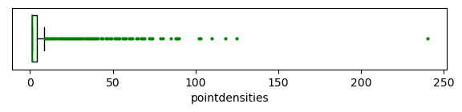

### Point densities {#sec-pointdensities}

Before proceeding, let's check whether our GBIF occurrence dataset shows any signs of bias by analyzing how the density of occurrences varies across the study area. We can do this by counting the number of observations within each grid cell. To accomplish this, we will use the [r.vect.stats](https://grass.osgeo.org/grass-stable/manuals/addons/r.vect.stats.html) module. It is one of the addons installed in @sec-addons. With the module we can create a raster layer with per raster cell the number of points from a vector point layer that fall within that cell.

We want to create the layer in the [Erebia_alberganus]{.style-data} mapset, so we switch to that mapset first. 

::: {#exm-3Tw6fEB0hg .hiddendiv}
:::

::: {.panel-tabset}
## 

``` bash
g.mapset mapset=Erebia_alberganus
```

## 

``` python
gs.run_command("g.mapset", mapset="Erebia_alberganus")
```

## 

![To change the mapset, right click on the name of the mapset in the [Data]{.style-menu} panel. In the context menu, select [Switch mapset]{.style-menu}.](images/switchmapset.png){#fig-switchmapset fig-align="left"}
:::

The raster layer that will be created with `v.vect.stats` should cover the same spatial extent as the point data and use the same spatial resolution as the bioclimatic layers, which is 2.5 arc degrees. To ensure this, we need to set the computational region accordingly (remember, the computational region defines the extent and resolution for raster operations in GRASS GIS).

We use the [g.region](https://grass.osgeo.org/grass-stable/manuals/g.region.html) module for this. The spatial extent of the region is defined using the [vector]{.style-parameter} parameter, which is set to the [occurrences]{.style-data} layer. The spatial resolution is taken from the [bio_1@climate]{.style-data} layer by setting the [raster]{.style-parameter} parameter. Finally, the [align]{.style-parameter} parameter ensures that the computational region is aligned with the grid of the [bio_1@climate]{.style-data} raster.


::: {#exm-DzyEuYlZum .hiddendiv}
:::

::: {.panel-tabset}
## 

``` bash
g.region raster=bio_1@climate vector=occurrences align=bio_1@climate
```

## 

``` python
gs.run_command(
    "g.region",
    raster="bio_1@climate",
    vector="occurrences",
    align="bio_1@climate",
)
```

## 

To change the region settings, open the `g.region` dialog, and fill in the following parameters:

| Parameter                      | Value                 |
|--------------------------------|-----------------------|
| raster                            | bio_1@climate              |
| align                            | bio_1@climate              |
| vector                         | occurrences |

: {tbl-colwidths="\[40,60\]"}


## 

We set the [vector]{.style-parameter} parameter to the [occurrences]{.style-data} layer to define the spatial extent of the region. The [raster]{.style-parameter} parameter is set to the [bio_1@climate]{.style-data} layer, which determines the spatial resolution of the region. Finally, the [align]{.style-parameter} parameter ensures that the region is aligned with the grid of the [bio_1@climate]{.style-data} raster layer.

:::

We can now run the `r.vect.stats` module. The [method]{.style-parameter} parameter specifies which statistic is calculated from the vector points for each raster grid cell. Here, we use [method=n]{.style-parameter} to count the number of points per cell, where [n]{.style-parameter} indicates a point count.

::: {#exm-Xj32c2jubU .hiddendiv}
:::

::: {.panel-tabset}
## 

``` bash
r.vect.stats input=occurrences output=pointdensities method=n
```

##  

``` python
gs.run_command(
    "r.vect.stats",
    input="occurrences",
    output="pointdensities",
    method="n",
)
```

## 

To calculate the point densities per grid cell, open the `r.vect.stats` dialog, and use the following parameter settings.

| Parameter | Value                 |
|-----------|-----------------------|
| input     | occurrences |
| output    | pointdensities        |
| method    | n                     |

: {tbl-colwidths="\[40,60\]"}
:::

After completing these steps, we have a raster layer ([pointdensities]{.style-data}) with the number of occurrences per cell. Remember that the extent and resolution of the raster cell is based on the extent of the point data and the resolution of the bioclim layers (@exm-DzyEuYlZum). In the next step, we compute some statistics. To exclude cells with 0 (zero) occurrences, we convert them to NULL using the [r.null](https://grass.osgeo.org/grass-stable/manuals/r.null.html) function. This ensures that only the cells where the species was observed (non-zero values) will be considered in subsequent steps.

::: {#exm-J7MoS70p6m .hiddendiv}
:::

::: {.panel-tabset}
## 

``` bash
r.null map=pointdensities setnull=0
```

## 

``` python
gs.run_command("r.null", map="pointdensities", setnull=0)
```

## 

Open the `r.null` dialog, and use the following parameter settings.

| Parameter | Value          |
|-----------|----------------|
| map       | pointdensities |
| setnull   | 0              |

: {tbl-colwidths="\[40,60\]"}
:::

We use [r.univar](https://grass.osgeo.org/grass-stable/manuals/r.univar.html) to compute the range and median of number of observations per grid cell and the [r.boxplot](https://grass.osgeo.org/grass-stable/manuals/addons/r.boxplot.html) addon to visualize the distribution of point densities and to identify possible outliers.

::: {#exm-WtuDMbpLQo .hiddendiv}
:::

::: {.panel-tabset}
## 

``` bash
# Compute raster statistics
r.univar -e map=pointdensities

# Run r.boxplot
r.boxplot -o -h map=pointdensities
```

## 

``` python
# Compute raster statistics
gs.run_command("r.univar", flags="e", map="pointdensities")

# Run r.boxplot
gs.run_command("r.boxplot", flags="o", map="pointdensities")
```

## 

Open the `r.univar` dialog, and use the following parameter settings. 

| Parameter                         | Value          |
|-----------------------------------|----------------|
| map                               | pointdensities |
| Calculate extended statistics (e) | ✅             |

: {tbl-colwidths="\[40,60\]"}

<br>Install the `r.boxplot` and run it with the following parameter settings.

| Parameter            | Value          |
|----------------------|----------------|
| Map                  | pointdensities |
| Include outliers (o) | ✅             |

: {tbl-colwidths="\[40,60\]"}

## 

The [-e]{.style-parameter} flag tells `r.univar` to calculate extended statistics, like the median.

:::

The results of `r.univar` show that the number of observations per raster cell range from 1 to 346, with a median of 3, and an average of 10. These results and the boxplot in @fig-pointdensitiesboxplot show that even though within the majority of non-NULL raster cells there is only one observation, there are also raster cells with many more observations, up to 240 point observations.
-->
<!---
r.boxplot -o -h map=pointdensities@Erebia_alberganus output=/home/paulo/Nextcloud/Projects/Readers/Ecodiv/sdm_in_grassgis/images/pointdensityboxplot.png plot_dimensions=7,1 --overwrite dpi=100 fontsize=6 median_color="#008021" flier_color="#008021"
-->
<!--
{#fig-pointdensitiesboxplot fig-align="left"}

If we look at the attribute table, we'll see that where there are many observations, they often span several years and often involve the same observer. This suggests that certain areas have been surveyed more extensively than others, potentially leading to uneven sampling effort across the species's range. 
