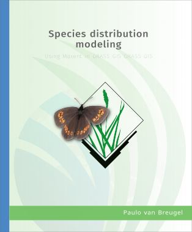

# Introduction

This repository contains the source of the [Species distribution modeling using Maxent in GRASS GIS](https://ecodiv.earth/TutorialsNotes/sdmingrassgis/) reader. The reader is built using [Quarto](https://quarto.org/). Species distribution modeling (SDM), also known as climate envelope modeling or niche modeling, are numerical methods that combine observations of species occurrence or abundance with environmental estimates. It is used to gain ecological and evolutionary insights and to predict distributions across landscapes, and have become an important tools in the toolbox of ecologists and professionals involved in e.g, conservation planning and management, biodiversity monitoring and environmental impact assessment.

> \[!NOTE\] \> This is work in progress, with more to come in the sections about fine-tuning options, model validation and automating the workflow. Suggestions and contributions are welcome.

Maxent is one of the more popular algorithms for species distribution modeling. Unlike many other algorithms, it focuses specifically on presence-only data, which is typically the type of data available. Maxent is, among others, [available](https://biodiversityinformatics.amnh.org/open_source/maxent/) as a stand-alone program and as R package [Maxnet](https://github.com/mrmaxent/maxnet). This tutorial focuses on the use of maxent addons for [GRASS GIS](https://grass.osgeo.org/learn/overview/). The objective is to introduce different modules in GRASS and to illustrate how they can be used to create an workflow for species distribution modeling in GRASS GIS. As example, we will use SDM to map the potential distribution of species using the example of the Almond-eyed Ringlet (*Erebia albergana*), a butterfly found in parts of Austria, Bulgaria, France, Italy, Serbia and Switzerland.

If you have any feedback or suggestions, or would like to contribute, you can create an issue, or pull request. Please note that all contributions should follow the [Contributor Code of Conduct](https://contributor-covenant.org/version/2/0/CODE_OF_CONDUCT.html).
